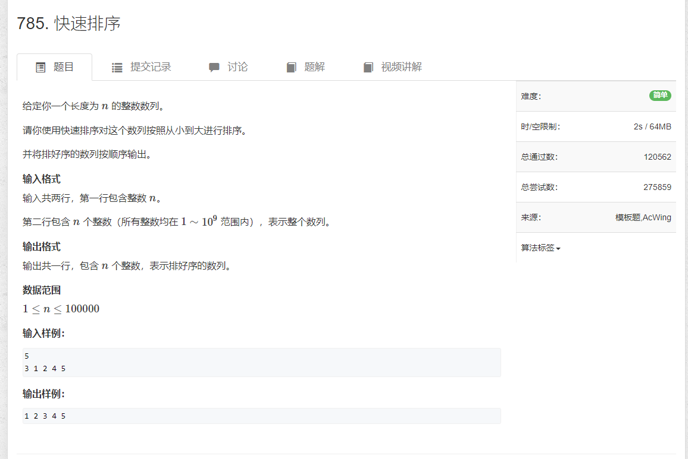
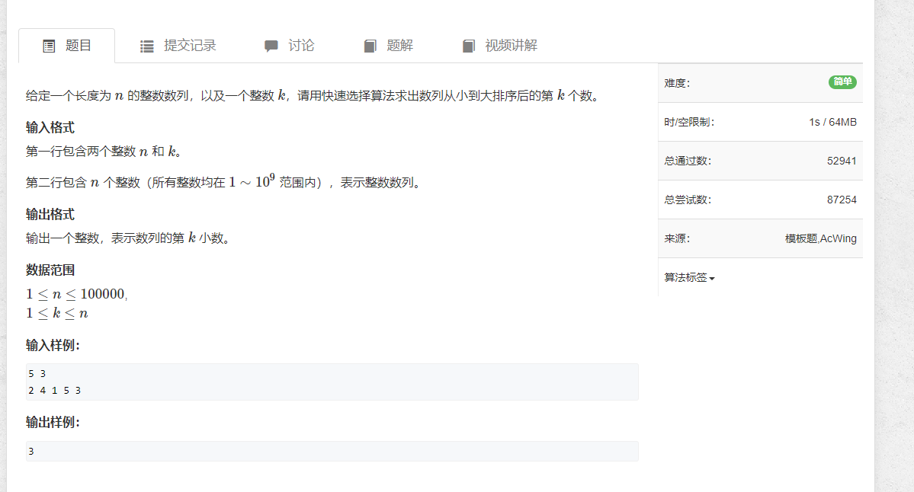

# 1. 快速排序



```java
import java.util.*;
import java.io.*;

public class Main {
    public static void main(String[] args) throws Exception {
        BufferedReader reader = new BufferedReader(new InputStreamReader(System.in));

        int n = Integer.parseInt(reader.readLine());
        int[] arr = new int[n];
        String[] strs = reader.readLine().split(" ");

        for (int i = 0; i < arr.length; i++) {
            arr[i] = Integer.parseInt(strs[i]);
        }

        sort(arr, 0, n - 1);

        for (int i = 0; i < n; i++) {
            System.out.print(arr[i] + " ");
        }

        reader.close();
    }

    private static void sort(int[] nums, int left, int right) {
        if (left >= right) {
            return;
        }

        int i = left - 1;
        int j = right + 1;
        int x = nums[i + j >> 1];
        while (i < j) {
            do {
                i++;
            } while (nums[i] < x);
            do {
                j--;
            } while (nums[j] > x);

            if (i < j) {
                int tmp = nums[i];
                nums[i] = nums[j];
                nums[j] = tmp;
            }
        }

        sort(nums, left, j);
        sort(nums, j + 1, right);
    }
}
```


# 2.快速选择


```sql
import java.util.*;
import java.io.*;

public class Main {
    public static void main(String[] args) throws IOException {
        BufferedReader reader = new BufferedReader(new InputStreamReader(System.in));

        int k = Integer.parseInt(reader.readLine().split(" ")[1]);
        String[] strs = reader.readLine().split(" ");

        int[] arr = new int[strs.length];
        for (int i = 0; i < arr.length; i++) {
            arr[i] = Integer.parseInt(strs[i]);
        }

        System.out.println(sort(arr, 0, arr.length - 1, k - 1));

        reader.close();
    }

    public static int sort(int[] arr, int left, int right, int k) {
        if (left >= right) {
            return arr[k];
        }

        int l = left - 1, r = right + 1, x = arr[l + r >> 1];
        while (l < r) {
            while (arr[++l] < x) {};
            while (arr[--r] > x) {};

            if (l < r) {
                int tmp = arr[l];
                arr[l] = arr[r];
                arr[r] = tmp;
            }
        }

        if (k <= r) {
            return sort(arr, left, r, k);
        } else {
            return sort(arr, r + 1, right, k);
        }
    }
}
```
