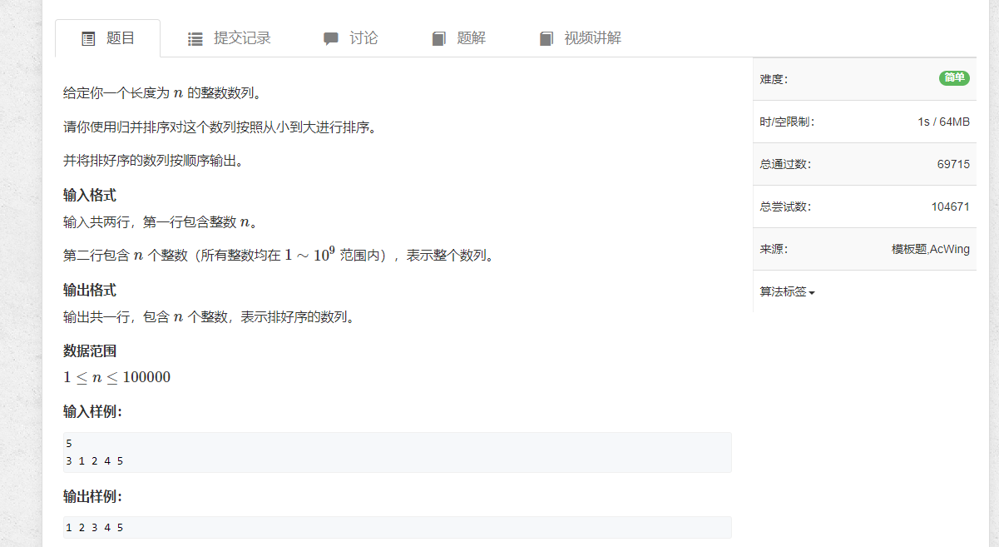
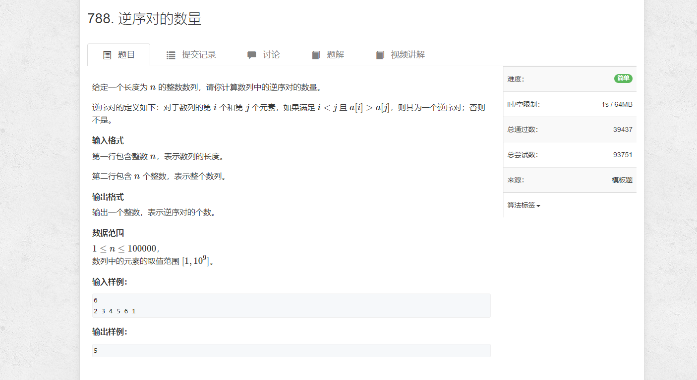

# 1.归并排序

```java
import java.util.*;
import java.io.*;

public class Main {
    public static void main(String[] args) throws IOException {
        BufferedReader reader = new BufferedReader(new InputStreamReader(System.in));

        int n = Integer.parseInt(reader.readLine());

        String[] strs = reader.readLine().split(" ");
        int[] arr = new int[n];
        for (int i = 0; i < n; i++) {
            arr[i] = Integer.parseInt(strs[i]);
        }

        int[] tmp = new int[n];
        sort(arr, 0, n - 1, tmp);

        for (int i = 0;  i< n; i++) {
            System.out.print(arr[i] + " ");
        }

        reader.close();
    }

    private static void sort(int[] arr, int left, int right, int[] tmp) {
        if (left >= right) return;
        int mid = (left + right ) / 2;
        sort(arr, left, mid, tmp);
        sort(arr, mid + 1, right, tmp);
        merge(arr, left, mid, right, tmp);
    }

    private static void merge(int[] arr, int left, int mid, int right, int[] tmp) {
        int i = left, j = mid + 1, idx = left;

        while(i <= mid && j <= right) {
            if (arr[i] > arr[j]) {
                tmp[idx++] = arr[j++];
            } else {
                tmp[idx++] = arr[i++];
            }
        }

        while (i <= mid) {
            tmp[idx++] = arr[i++];
        }
        while (j <= right) {
            tmp[idx++] = arr[j++];
        }

        for (int k = left; k <= right; k++) {
            arr[k] = tmp[k];
        }
    }
}
```

# 2. 逆序对的数量


```sql
import java.util.*;
import java.io.*;

public class Main {

    static int[] tmp;
    static long total;

    public static void main(String[] args) throws IOException {
        BufferedReader reader = new BufferedReader(new InputStreamReader(System.in));

        int n = Integer.parseInt(reader.readLine());
        String[] strs = reader.readLine().split(" ");

        int[] arr = new int[n];
        tmp = new int[n];
        total = 0;

        for (int i = 0; i < n; i++) {
            arr[i] = Integer.parseInt(strs[i]);
        }

        sort(arr, 0, n - 1);
        System.out.println(total);
        reader.close();
    }

    public static void sort(int[] nums, int left, int right) {
        if (left >= right) {
            return;
        }

        int mid = (left + right) / 2;
        sort(nums, left, mid);
        sort(nums, mid + 1, right);

        int i = left, j = mid + 1, k = left;
        while (i <= mid && j <= right) {
            if (nums[i] <= nums[j]) {
                tmp[k++] = nums[i++];
            } else {
                tmp[k++] = nums[j++];
                total += mid - i + 1;
            }
        }

        while (i <= mid) {
            tmp[k++] = nums[i++];
        }
        while (j <= right) {
            tmp[k++] = nums[j++];
        }

        for (int idx = left; idx <= right; idx++) {
            nums[idx] = tmp[idx];
        }

        return;
    }
}
```
