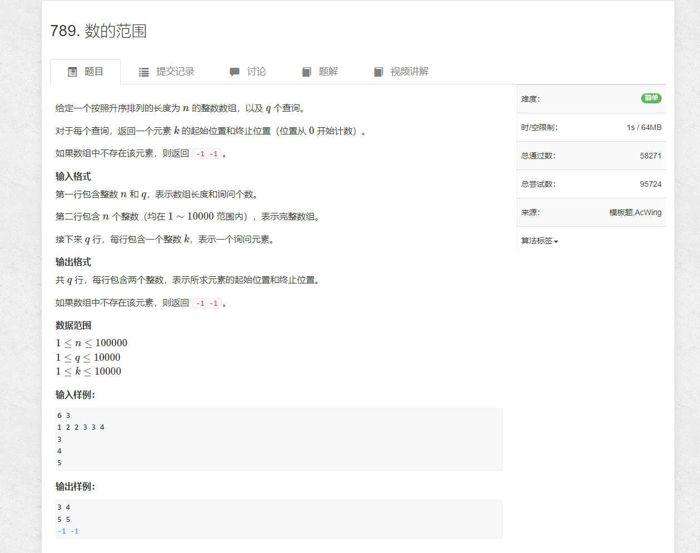
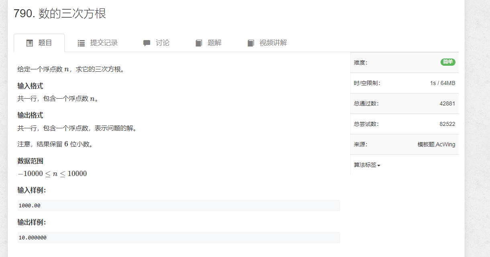

# 0.模板
## 0.1
当我们将区间[l, r]划分成[l, mid]和[mid + 1, r]时，其更新操作是r = mid或者l = mid + 1;，计算mid时不需要加1。
```c
int bsearch_1(int l, int r)
{
    while (l < r)
    {
        int mid = l + r >> 1;
        if (check(mid)) r = mid;
        else l = mid + 1;
    }
    return l;
}
```

## 0.2
当我们将区间[l, r]划分成[l, mid - 1]和[mid, r]时，其更新操作是r = mid - 1或者l = mid;，此时为了防止死循环，计算mid时需要加1。
```c
int bsearch_2(int l, int r)
{
    while (l < r)
    {
        int mid = l + r + 1 >> 1;
        if (check(mid)) l = mid;
        else r = mid - 1;
    }
    return l;
}
```


# 1. 数的范围

```java
import java.util.*;
import java.io.*;

public class Main {
    public static void main(String[] args) throws IOException {
        BufferedReader reader = new BufferedReader(new InputStreamReader(System.in));

        String[] strs = reader.readLine().split(" ");
        int m = Integer.parseInt(strs[0]);
        int n = Integer.parseInt(strs[1]);

        strs = reader.readLine().split(" ");
        int[] arr = new int[m];
        for (int i = 0; i < m; i++) {
            arr[i] = Integer.parseInt(strs[i]);
        }

        for (int i = 0; i < n; i++) {
            int num = Integer.parseInt(reader.readLine());
            met(arr, num);
        }


        reader.close();
    }


    private static void met(int[] arr, int num) {
        int l = 0, r = arr.length - 1;

        while (l < r) {
            int mid = l + r >> 1;
            if (arr[mid] >= num) {
                r = mid;
            } else {
                l = mid + 1;
            }
        }

        if (arr[l] != num) {
            System.out.println("-1 -1");
            return;
        }

        int resL = l;
        l = 0;
        r = arr.length - 1;
        while (l < r) {
            int mid = (l + r + 1) >> 1;
            if (arr[mid] <= num) {
                l = mid;
            } else {
                r = mid  - 1;
            }
        }

        System.out.println(resL + " " + l);
    }
}
```

# 2. 数的三次方根

```java
import java.util.*;
import java.io.*;

public class Main {
    public static void main(String[] args) throws IOException {
        BufferedReader reader = new BufferedReader(new InputStreamReader(System.in));

        double x = Double.parseDouble(reader.readLine());
        double l = -10000.0;
        double r = 10000.0;

        // 保留6位的话，尝试计算7位
        while (r - l > 1e-7) {
            double m = (l + r) / 2;
            if (m * m * m >= x) r = m;
            else l = m;
        }

        System.out.printf("%.6f", l);

        reader.close();
    }
}
```
