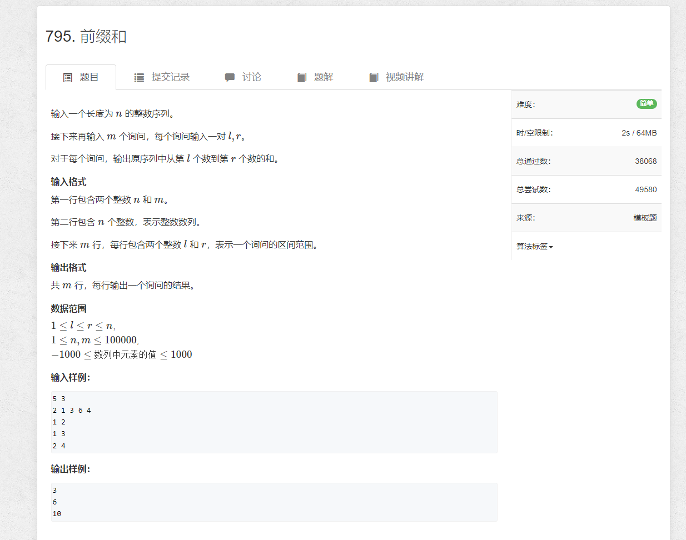
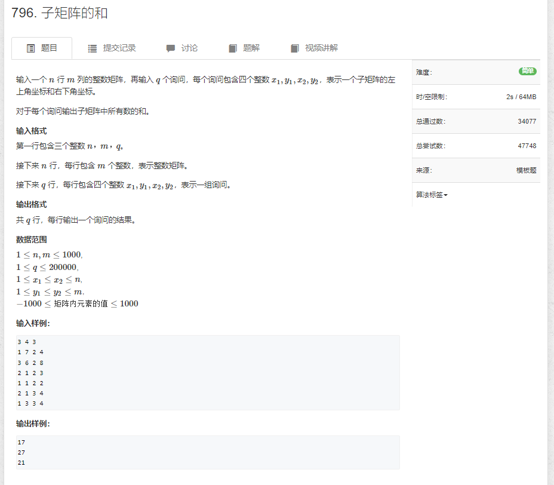
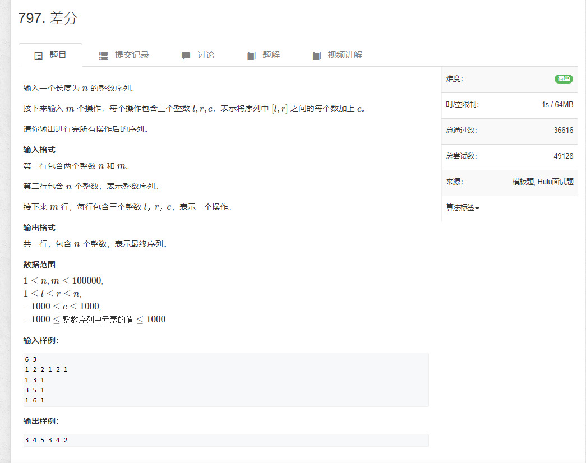

# 1.前缀和


```java
import java.io.*;
import java.util.*;

public class Main {

    static int N = 100010;

    public static void main(String[] args) throws IOException {
        BufferedReader reader = new BufferedReader(new InputStreamReader(System.in));

        String[] strs = reader.readLine().split(" ");
        int n = Integer.parseInt(strs[0]);
        int m = Integer.parseInt(strs[1]);

        int[] arr = new int[N];
        strs = reader.readLine().split(" ");
        for (int i = 1; i <= n; i++) {
            arr[i] = Integer.parseInt(strs[i - 1]);
        }

        int[] S = new int[N];
        for (int i = 1; i <= n; i++) {
            S[i] = S[i - 1] + arr[i];
        }

        for (int i = 1; i <= m; i++) {
            strs = reader.readLine().split(" ");
            int l = Integer.parseInt(strs[0]);
            int r = Integer.parseInt(strs[1]);
            System.out.println(S[r] - S[l - 1]);
        }

        reader.close();
    }
}
```


# 2. 子矩阵的和



```sql
import java.util.*;
import java.io.*;

public class Main {

    static int N;
    static int M;
    static int q;
    static int[][] arr;

    public static void main(String[] args) throws IOException {
        BufferedReader reader = new BufferedReader(new InputStreamReader(System.in));

        String[] strs = reader.readLine().split(" ");
        N = Integer.parseInt(strs[0]);
        M = Integer.parseInt(strs[1]);
        q = Integer.parseInt(strs[2]);
        arr = new int[N][M];

        for (int i = 0; i < N; i++) {
            strs = reader.readLine().split(" ");
            for (int j = 0; j < M; j++) {
                arr[i][j] = Integer.parseInt(strs[j]);
            }
        }

        int[][] nums = new int[N + 1][M + 1];
        for (int i = 1; i <= N; i++) {
            for (int j = 1; j <= M; j++) {
                nums[i][j] = arr[i - 1][j - 1] +
                            nums[i - 1][j] +
                            nums[i][j - 1] -
                            nums[i - 1][j - 1];
            }
        }

        for (int i = 0; i < q; i++) {
            strs = reader.readLine().split(" ");
            int a = Integer.parseInt(strs[0]);
            int b = Integer.parseInt(strs[1]);
            int c = Integer.parseInt(strs[2]);
            int d = Integer.parseInt(strs[3]);

            int res = nums[c][d] - nums[c][b - 1] - nums[a - 1][d] + nums[a - 1][b - 1];
            System.out.println(res);
        }
        //System.out.println(Arrays.deepToString(nums));

        reader.close();
    }
}

```

# 3.差分

```java
import java.util.*;
import java.io.*;

public class Main {

    static int N = 100010;
    static int[] b = new int[N];
    static int n;
    static int m;
    static String[] strs;

    static BufferedReader reader = new BufferedReader(new InputStreamReader(System.in));
    static BufferedWriter writer = new BufferedWriter(new OutputStreamWriter(System.out));

    static int strToInt(String str) {
        return Integer.parseInt(str);
    }

    static String[] readToStrs() throws IOException {
        return reader.readLine().split(" ");
    }

    public static void main(String[] args) throws IOException {
        strs = readToStrs();
        n = strToInt(strs[0]);
        m = strToInt(strs[1]);

        strs = readToStrs();
        for (int i = 1; i <= n; i++) {
            insert(i, i, strToInt(strs[i - 1]));
        }

        for (int i = 1; i <= m; i++) {
            strs = readToStrs();
            int l = strToInt(strs[0]);
            int r = strToInt(strs[1]);
            int c = strToInt(strs[2]);
            insert(l, r, c);
        }

        init();
        for (int i = 1; i <= n; i++) {
            writer.write(b[i] + " ");
        }
        writer.flush();
    }

    static void init() {
        for (int i = 1; i <= n; i++) {
            b[i] = b[i - 1] + b[i];
        }
    }

    static void insert(int l, int r, int c) {
        b[l] += c;
        b[r + 1] -= c;
    }
}
```
