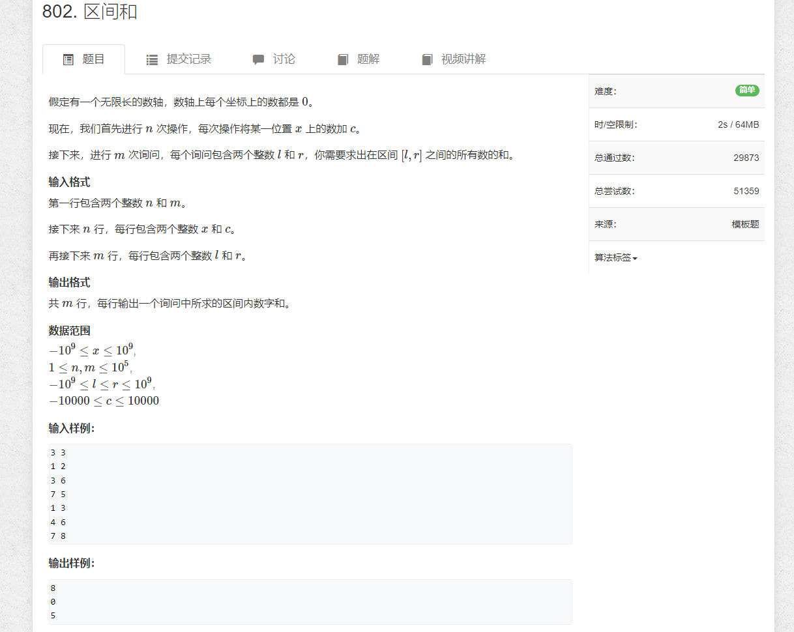

# 1.区间和


```java
import java.util.*;
import java.io.*;

public class Main {
    static BufferedReader reader = new BufferedReader(new InputStreamReader(System.in));
    static BufferedWriter writer = new BufferedWriter(new OutputStreamWriter(System.out));
    static int n, m;
    static TreeMap<Integer, Integer> map;

    static int sti(String str) {
        return Integer.parseInt(str);
    }

    static String[] rts() throws IOException {
        return reader.readLine().split(" ");
    }

    public static void main(String[] args) throws IOException {
        map = new TreeMap<>();
        map.put((int)(-10e9 - 1), 0);
        String[] strs = rts();
        n = sti(strs[0]);
        m = sti(strs[1]);

        for (int i = 0;  i < n; i++) {
            strs = rts();
            int x = sti(strs[0]);
            int c = sti(strs[1]);
            int prev = (map.containsKey(x) ? map.get(x) : 0);
            map.put(x, c + prev);
        }


        Map.Entry<Integer, Integer> prev = null;
        for (Map.Entry<Integer, Integer> m : map.entrySet()) {
           if (prev != null) m.setValue(prev.getValue() + m.getValue());
           prev = m;
        }
        for (int i = 0; i < m; i++) {
            strs = rts();
            int l = sti(strs[0]);
            int r = sti(strs[1]);
            System.out.println(map.floorEntry(r).getValue() - map.floorEntry(l - 1).getValue());

        }

        writer.flush();
    }


}
```
