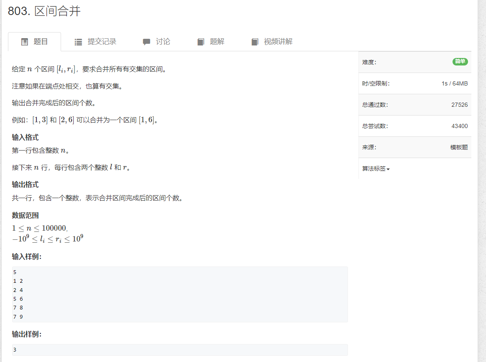

# 2.区间合并



```java
import java.util.*;
import java.io.*;

public class Main {
    static BufferedReader reader = new BufferedReader(new InputStreamReader(System.in));
    static BufferedWriter writer = new BufferedWriter(new OutputStreamWriter(System.out));

    static int sti(String str) {
        return Integer.parseInt(str);
    }

    static String[] rts() throws IOException {
        return reader.readLine().split(" ");
    }

    public static void main(String[] args) throws IOException {
        int n = sti(rts()[0]);
        String[] strs = null;
        List<int[]> list = new ArrayList<>();

        while (n-- > 0) {
            strs = rts();
            int l = sti(strs[0]);
            int r = sti(strs[1]);

            list.add(new int[]{l, r});
        }

        LinkedList<int[]> res = new LinkedList<>();
        list.sort((o1, o2) -> o1[1] - o2[1]);

        for (int[] a : list) {
            while (!res.isEmpty() && a[0] <= res.peek()[1]) {
                int[] cur = res.pop();
                a[0] = Math.min(a[0], cur[0]);
            }
            res.push(a);

        }

        // for (int i = 0; i < res.size(); i++) {
        //     writer.write(Arrays.toString(res.get(i)) + "\n");
        // }
        writer.write(res.size() + "\n");

        writer.flush();
    }

}
```
