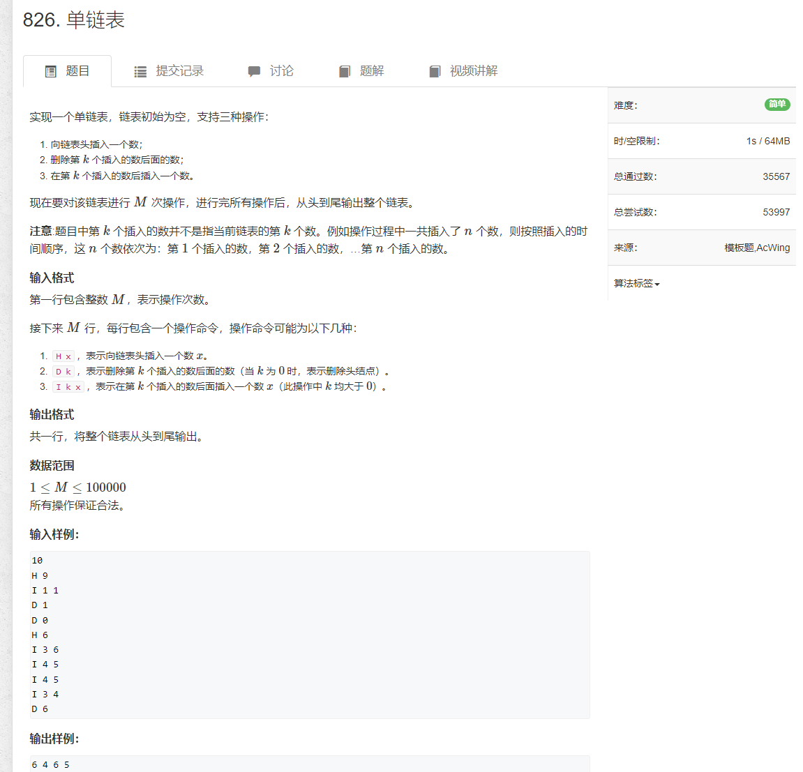

# 1.单链表


```java
import java.util.*;
import java.io.*;

public class Main {
    static BufferedReader reader = new BufferedReader(new InputStreamReader(System.in));
    static BufferedWriter writer = new BufferedWriter(new OutputStreamWriter(System.out));

    static Integer sti(String s) {
        return Integer.parseInt(s);
    }

    static String[] rts() throws IOException {
        return reader.readLine().split(" ");
    }

    static int N = 10_0010;
    static int head, idx;
    static int[] e = new int[N];
    static int[] ne = new int[N];

    static void init() {
        head = -1;
        idx = 0;
    }

    /**
     *  在头部插入节点
     */
    static void addToHead(int x) {
        e[idx] = x;
        ne[idx] = head;
        head = idx;
        idx++;
    }


    static void add(int k, int x) {
        e[idx] = x;
        ne[idx] = ne[k];
        ne[k] = idx;
        idx++;
    }

    static void del(int k) {
        if (k == -1) {
            head = ne[head];
        } else {
            ne[k] = ne[ne[k]];
        }
    }

    public static void main(String[] args) throws IOException {
        init();
        int n = sti(rts()[0]);

        String[] strs = null;
        while (n-- > 0) {
            strs = rts();

            switch (strs[0]) {
                case "H" :{
                    int x = sti(strs[1]);
                    addToHead(x);
                    break;
                }
                case "I" : {
                    int k = sti(strs[1]);
                    int x = sti(strs[2]);
                    add(k - 1, x);
                    break;
                }
                case "D" : {
                    int k = sti(strs[1]);
                    del(k - 1);
                    break;
                }
                default : {
                    break;
                }
            }
        }

        for (int i = head; i != -1; i = ne[i]) {
            writer.write(e[i] + " ");
        }
        writer.write("\n");

        writer.flush();
    }

}
```
