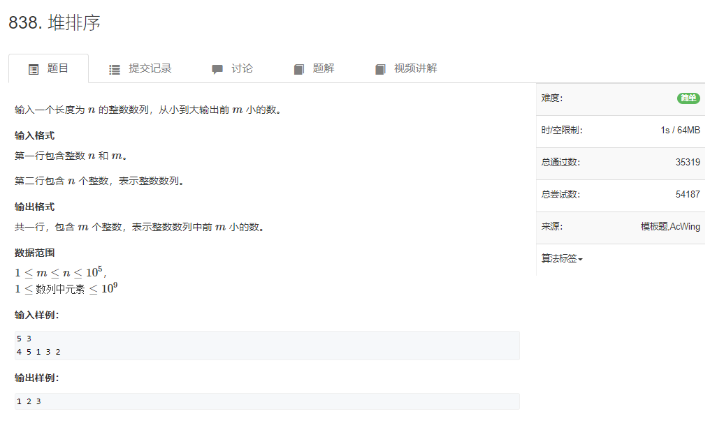
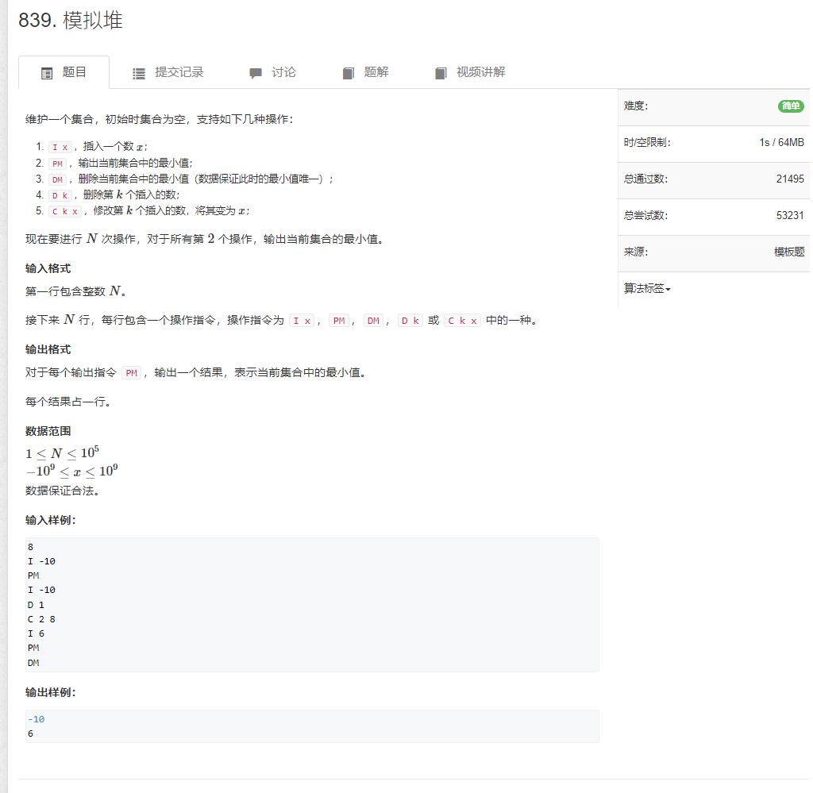

# 838.堆排序

```java
import java.util.*;
import java.io.*;

public class Main {

    static int N = 100010;
    static int[] arr = new int[N];
    static int n;
    static int idx = 1;

    static void down(int x) {
        int t = x;

        if (2 * x < idx && arr[2 * x] < arr[t]) t = 2 * x;
        if (2 * x + 1 < idx && arr[2 * x + 1] < arr[t]) t = 2 * x + 1;
        if (t != x) {
            int temp = arr[x];
            arr[x] = arr[t];
            arr[t] = temp;
            down(t);
        }
    }

    public static void main(String[] args) {
        Scanner input = new Scanner(System.in);
        n = input.nextInt();
        int m = input.nextInt();

        for (int i = 1; i <= n; i++) {
            arr[idx++] = input.nextInt();
        }

        for (int i = n / 2; i > 0; i--) {
            down(i);
        }

        for (int i = 1;  i <= m; i++) {
            System.out.print(arr[1] + " ");
            arr[1] = arr[--idx];
            down(1);
        }
    }
}
```

# 839.模拟堆

```java
import java.util.*;
import java.io.*;
class Main{
    static BufferedReader read = new BufferedReader(new InputStreamReader(System.in));
    static BufferedWriter log  = new BufferedWriter(new OutputStreamWriter(System.out));

    static int[] h;
    static int[] ph;  //存放第k个插入点的下标
    static int[] hp;  //存放堆中点的插入次序
    static int size;
    public static void main(String[] args) throws Exception{
        int n = Integer.valueOf(read.readLine());
        h = new int[n + 1];
        ph = new int[n + 1];
        hp = new int[n + 1];
        size = 0;
        int m=0;      //m用来记录插入的数的个数
        while(n-- > 0){
            String[] s = read.readLine().split(" ");
            String op = s[0];
            if("I".equals(op)){
                int x = Integer.valueOf(s[1]);
                m++;
                h[++size]=x;
                ph[m]=size;
                hp[size]=m;
                //down(size);
                up(size);
            }else if("PM".equals(op))    log.write(h[1] + "\n");
            else if("DM".equals(op)){
                heapSwap(1,size);
                size--;
                down(1);
            }else if("D".equals(op)){
                int k = Integer.valueOf(s[1]);
                int u=ph[k];                //这里一定要用u=ph[k]保存第k个插入点的下标
                heapSwap(u,size);          //因为在此处heapSwap操作后ph[k]的值已经发生
                size--;                    //如果在up,down操作中仍然使用ph[k]作为参数就会发生错误
                up(u);
                down(u);
            }else if("C".equals(op)){
                int k = Integer.valueOf(s[1]);
                int x = Integer.valueOf(s[2]);
                h[ph[k]]=x;                 //此处由于未涉及heapSwap操作且下面的up、down操作只会发生一个所以
                down(ph[k]);                //所以可直接传入ph[k]作为参数
                up(ph[k]);
            }
        }
        log.flush();
    }

    //这个交换过程其实有那么些绕 但关键是理解 如果hp[u]=k 则ph[k]=u 的映射关系
    //之所以要进行这样的操作是因为 经过一系列操作 堆中的元素并不会保持原有的插入顺序
    //从而我们需要对应到原先第K个堆中元素
    //如果理解这个原理 那么就能明白其实三步交换的顺序是可以互换
    //h,hp,ph之间两两存在映射关系 所以交换顺序的不同对结果并不会产生影响
    public static void heapSwap(int u, int v){
        swap(h,u,v);
        swap(hp, u, v);
        swap(ph, hp[u], hp[v]);
    }

    public static void swap(int[] a, int u, int v){
        int tmp = a[u];
        a[u] = a[v];
        a[v] = tmp;
    }

    public static void down(int u){
        int t = u;
        if(u * 2 <= size && h[t] > h[u * 2]) t = u * 2;
        if(u * 2 + 1 <= size && h[t] > h[u * 2 + 1]) t = u * 2 + 1;
        if(u != t){
            heapSwap(u, t);
            down(t);
        }
    }

    public static void up(int u){
        if(u / 2 > 0 && h[u] < h[u / 2]){
            heapSwap(u, u / 2);
            up(u/2);
        }
    }
}

```
