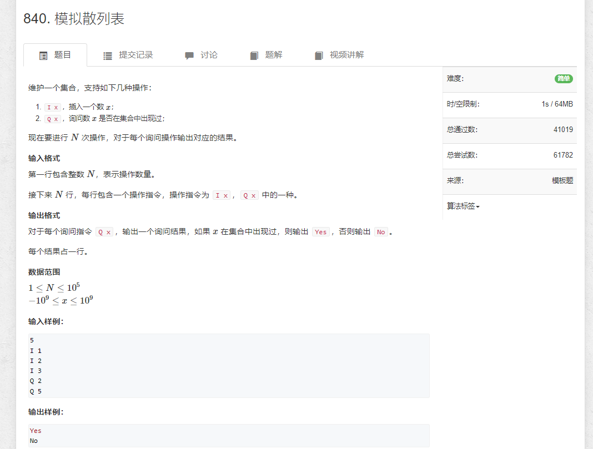
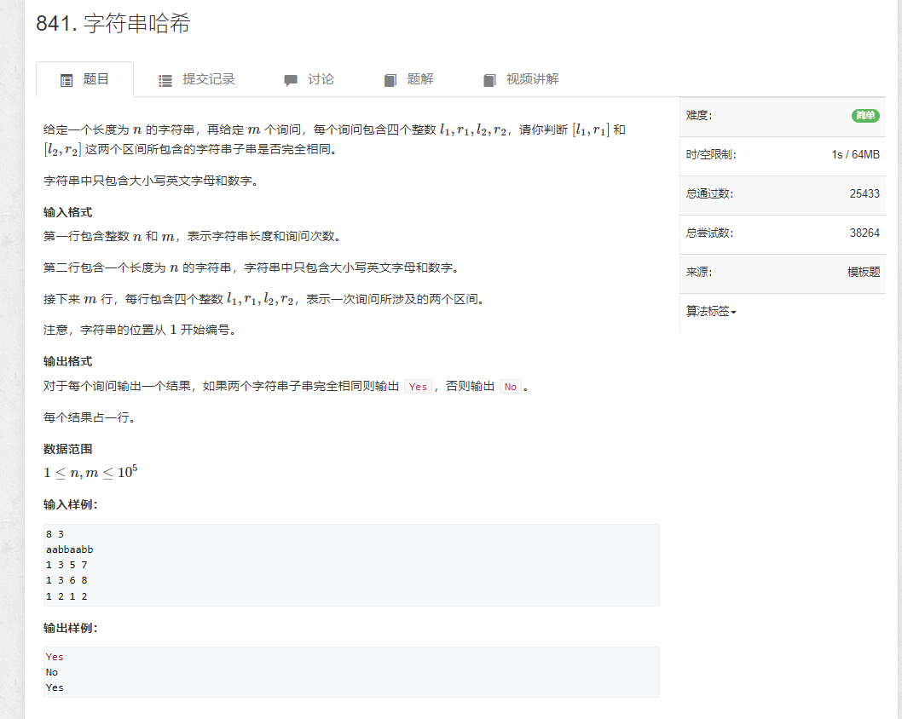

# 841.模拟散列表

```java
import java.util.*;
import java.io.*;

public class Main {

    static BufferedReader reader = new BufferedReader(new InputStreamReader(System.in));
    static BufferedWriter writer = new BufferedWriter(new OutputStreamWriter(System.out));

    static Integer sti(String s) {
        return Integer.parseInt(s);
    }

    static String[] rts() throws IOException {
        return reader.readLine().split(" ");
    }

    static int N = 100003;
    static int[] h = new int[N];
    static int[] ne = new int[N];
    static int[] e = new int[N];
    static int idx = 1;

    static boolean find(int x) {
        int id = (x % N + N) % N;

        for (int i = h[id]; i != -1; i = ne[i]) {
            //writer.write(e[i] + "\n");
            if (x == e[i]) {
                return true;
            }
        }

        return false;
    }

    static void insert(int x) {
        int id = (x % N + N) % N;

        e[idx] = x;
        ne[idx] = h[id];
        h[id] = idx++;
    }


    public static void main(String[] args) throws IOException {
        Arrays.fill(h, -1);
        int n = sti(rts()[0]);
        String[] strs = null;
        while (n-- > 0) {
            strs = rts();

            if ("I".equals(strs[0])) {
                int x = sti(strs[1]);
                insert(x);
            } else {
                boolean f = find(sti(strs[1]));
                writer.write(f ? "Yes\n" : "No\n");
            }

            //writer.write(Arrays.toString(Arrays.copyOf(e, 11)) + "\n");
        }

        //writer.write(Arrays.toString(Arrays.copyOf(e, 11)));
        writer.flush();
    }
}
```

# 842.字符串哈希

