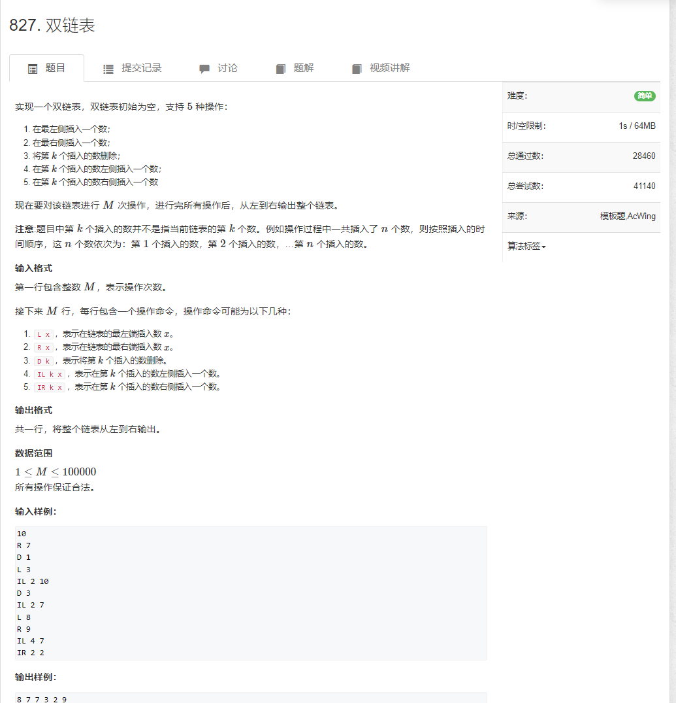

```java
import java.util.*;
import java.io.*;

public class Main {

    static BufferedReader reader = new BufferedReader(new InputStreamReader(System.in));
    static BufferedWriter writer = new BufferedWriter(new OutputStreamWriter(System.out));
    static Integer sti(String s) {
        return Integer.parseInt(s);
    }

    static String[] rts() throws IOException {
        return reader.readLine().split(" ");
    }

    static int N = 10_0010;
    static int[] l = new int[N];
    static int[] r = new int[N];
    static int[] e = new int[N];
    static int idx;

    static void init() {
        r[0] = 1;
        l[1] = 0;
        idx = 2;
    }

    static void add(int k, int x) {
        e[idx] = x;

        l[idx] = k;
        r[idx] = r[k];
        l[r[k]] = idx;
        r[k] = idx;

        idx++;
    }

    static void del(int k) {
        l[r[k]] = l[k];
        r[l[k]] = r[k];
    }

    public static void main(String[] args) throws IOException {
        init();
        int n = sti(rts()[0]);

        String[] strs = null;
        while (n-- > 0) {
            strs = rts();

            switch (strs[0]) {

                case "L" : {
                    int x = sti(strs[1]);
                    add(0, x);
                    break;
                }

                case "R" : {
                    int x = sti(strs[1]);
                    add(l[1], x);
                    break;
                }

                case "D" : {
                    int k = sti(strs[1]);
                    del(k + 1);
                    break;
                }

                case "IL" : {
                    int k = sti(strs[1]);
                    int x = sti(strs[2]);
                    add(l[k + 1], x);
                    break;
                }

                case "IR" : {
                    int k = sti(strs[1]);
                    int x = sti(strs[2]);
                    add(k + 1, x);
                    break;
                }

                default : {
                    break;
                }

            }

        }

        for (int i = r[0]; i != 1; i = r[i]) {
            writer.write(e[i] + " ");
        }
        writer.write("\n");
        writer.flush();
    }

}
```
