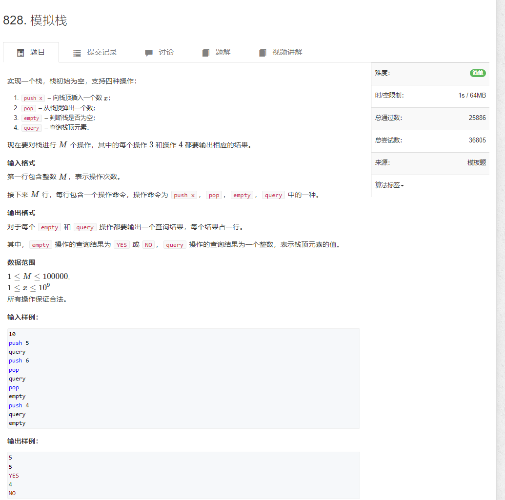

# 模拟栈


```java
import java.util.*;
import java.io.*;

public class Main {
    static BufferedReader reader = new BufferedReader(new InputStreamReader(System.in));
    static BufferedWriter writer = new BufferedWriter(new OutputStreamWriter(System.out));

    static Integer sti(String str) {
        return Integer.parseInt(str);
    }

    static String[] rts() throws IOException {
        return reader.readLine().split(" ");
    }

    static int N = 100010;
    static int[] s = new int[N];
    static int idx = -1;

    public static void main(String[] args) throws IOException {
        int n = sti(rts()[0]);
        String[] strs = null;
        while (n-- > 0) {
            strs = rts();

            switch (strs[0]) {
                case "push" : {
                    s[++idx] = sti(strs[1]);
                    break;
                }

                case "pop" : {
                    idx--;
                    break;
                }

                case "query" : {
                    writer.write(s[idx] + "\n");
                    break;
                }

                case "empty" : {
                    writer.write(idx > -1 ? "NO\n" : "YES\n");
                    break;
                }

                default : {
                    break;
                }
            }

        }


        writer.flush();
    }
}
```

# 表达式求值
```java
import java.util.*;
import java.io.*;

public class Main{

    private static LinkedList<Long> nums;
    private static LinkedList<Character> ops;
    private static Map<Character, Integer> map;

    private static void init() {
        nums = new LinkedList<>();
        ops = new LinkedList<>();
        map = new HashMap<>();
        map.put('+', 1);
        map.put('-', 1);
        map.put('*', 2);
        map.put('/', 2);
    }

    private static void eval() {
        long b = nums.pop();
        long a = nums.pop();

        char c = ops.pop();
        long x = 0L;
        if (c == '+') {
            x = a + b;
        } else if (c == '-') {
            x = a - b;
        } else if (c == '*') {
            x = a * b;
        } else if (c == '/') {
            x = a / b;
        }
        nums.push(x);
    }

    public static void main(String[] args) throws IOException {
        BufferedReader reader = new BufferedReader(new InputStreamReader(System.in));
        init();

        String strs = reader.readLine();
        int idx = 0;

        while (idx < strs.length()) {
            char c = strs.charAt(idx);
            if (Character.isDigit(c)) {
                long num = 0L;
                while (idx < strs.length() && Character.isDigit(strs.charAt(idx))) {
                    num = num * 10 + (strs.charAt(idx++) - '0');
                }
                nums.push(num);
            } else {
                if (c == '(') {
                    ops.push(c);
                } else if (c == ')') {
                    while (ops.size() > 0 && ops.peek() != '(') {
                        eval();
                    }
                    ops.pop();
                } else {
                    while (ops.size() > 0 && ops.peek() != '(' && map.get(ops.peek()) >= map.get(c)) {
                        eval();
                    }
                    ops.push(c);
                }
                idx++;
            }

        }

        while (ops.size() > 0) {
            eval();
        }

        System.out.println(nums.peek());


        reader.close();
    }
}
```
