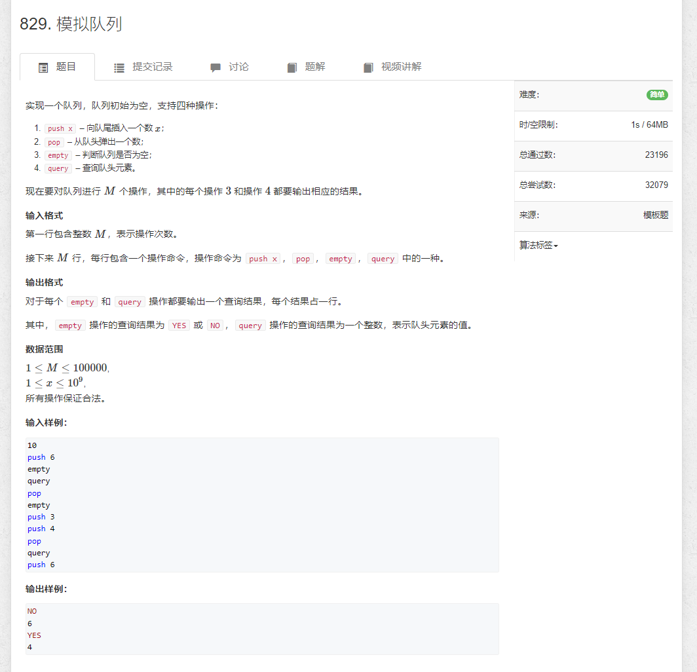

# 模拟队列


```java
import java.util.*;
import java.io.*;

public class Main{

    private static final int N = 100010;
    private static int[] nums;
    private static int i;
    private static int j;

    public static void init() {
        nums = new int[N];
        i = 0;
        j = 0;
    }

    public static void main(String[] args) throws IOException{
        BufferedReader reader = new BufferedReader(new InputStreamReader(System.in));

        init();
        int m = Integer.parseInt(reader.readLine().split(" ")[0]);
        for (int i = 0; i < m; i++) {
            String[] strs = reader.readLine().split(" ");
            switch(strs[0]) {
                case "push" : {
                    push(Integer.parseInt(strs[1]));
                    break;
                }
                case "pop" : {
                    pop();
                    break;
                }
                case "query" : {
                    query();
                    break;
                }
                case "empty" : {
                    if (empty()) {
                        System.out.println("YES");
                    } else {
                        System.out.println("NO");
                    }
                    break;
                }
                default : {
                    break;
                }
            }
        }

        reader.close();
    }

    private static void push(int x) {
        nums[j++] = x;
    }

    private static void pop() {
        i++;
    }

    private static void query() {
        System.out.println(nums[i]);
    }

    private static boolean empty() {
        return i == j;
    }
}
```
