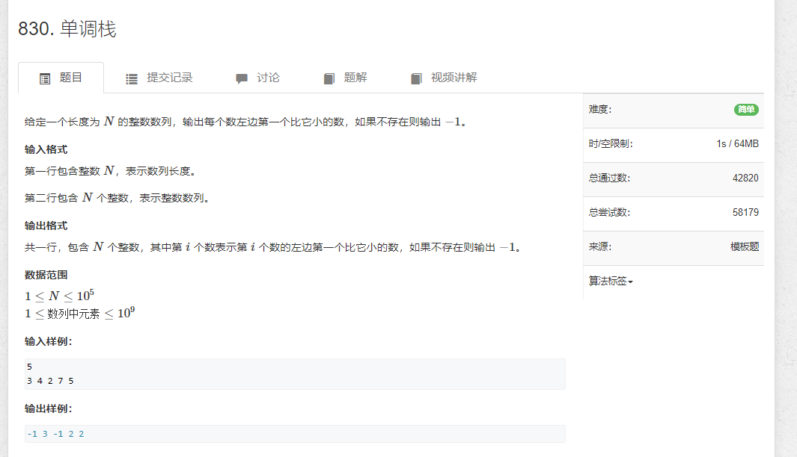

# 830.单调栈

```java
import java.util.*;
import java.io.*;

public class Main {
    static BufferedReader reader = new BufferedReader(new InputStreamReader(System.in));
    static BufferedWriter writer = new BufferedWriter(new OutputStreamWriter(System.out));

    static Integer sti(String str) {
        return Integer.parseInt(str);
    }

    static String[] rts() throws IOException {
        return reader.readLine().split(" ");
    }

    public static void main(String[] args) throws IOException {
        rts();
        String[] strs = rts();
        LinkedList<Integer> stack = new LinkedList<>();
        
        for (String s : strs) {
            int n = sti(s);

            while (!stack.isEmpty() && stack.peekLast() >= n) {
                stack.removeLast();
            }

            writer.write((stack.isEmpty() ? "-1" : stack.peekLast()) + " ");
            stack.addLast(n);
        }

        writer.flush();
    }
}
```
