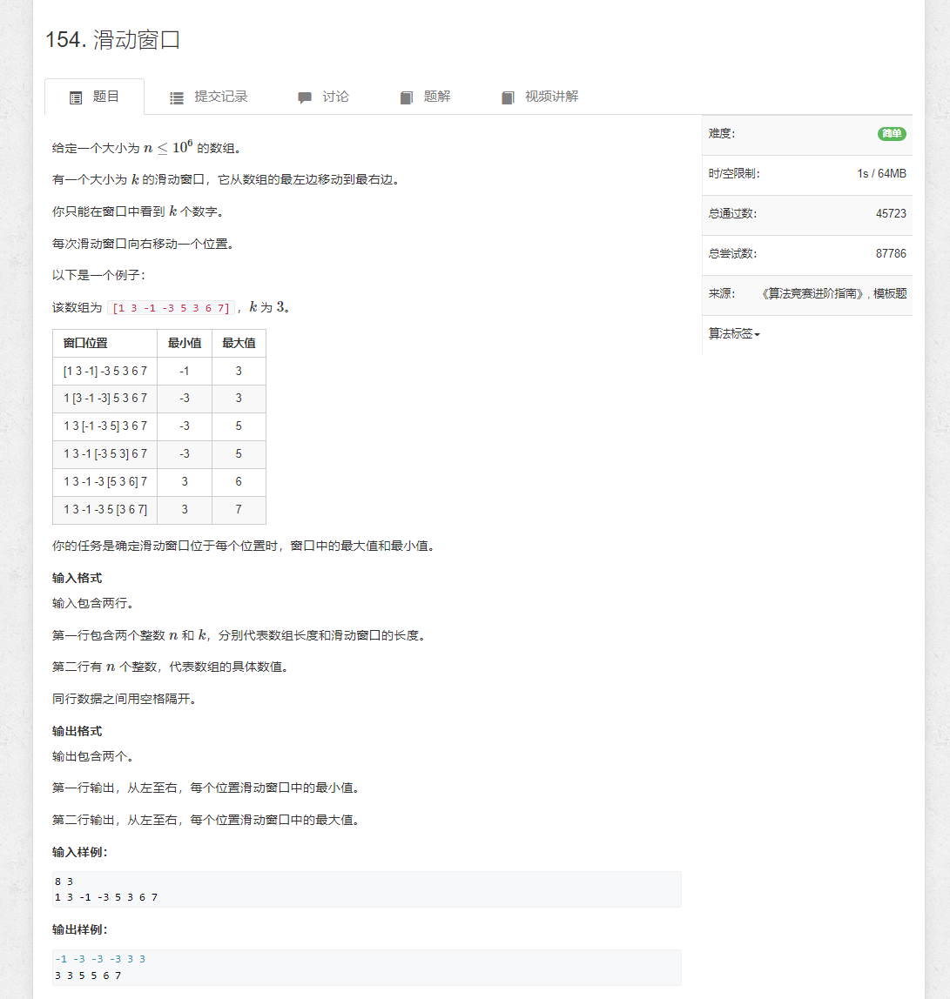

# 154.滑动窗口

```java
import java.util.*;
import java.io.*;

public class Main {
    static BufferedReader reader = new BufferedReader(new InputStreamReader(System.in));
    static BufferedWriter writer = new BufferedWriter(new OutputStreamWriter(System.out));

    static Integer sti(String str) {
        return Integer.parseInt(str);
    }

    static String[] rts() throws IOException {
        return reader.readLine().split(" ");
    }

    public static void main(String[] args) throws IOException {
        int n, k;
        String[] strs = rts();
        n = sti(strs[0]);
        k = sti(strs[1]);

        int[] arr = new int[n];
        strs = rts();
        for (int i = 0; i < n; i++) {
            arr[i] = sti(strs[i]);
        }

        LinkedList<Integer> queue = new LinkedList<>();
        for (int i = 0; i < n; i++) {

            if (!queue.isEmpty() && queue.peekFirst() == i - k) queue.removeFirst();

            while (!queue.isEmpty() && arr[queue.peekLast()] >= arr[i]) queue.removeLast();
            queue.addLast(i);

            if (i >= k - 1) writer.write(arr[queue.peekFirst()] + " ");
        }
        writer.newLine();

        queue = new LinkedList<>();
        for (int i = 0; i < n; i++) {

            if (!queue.isEmpty() && queue.peekFirst() == i - k) queue.removeFirst();

            while (!queue.isEmpty() && arr[queue.peekLast()] <= arr[i]) queue.removeLast();
            queue.addLast(i);

            if (i >= k - 1) writer.write(arr[queue.peekFirst()] + " ");
        }
        writer.newLine();

        writer.flush();
    }

}
```
