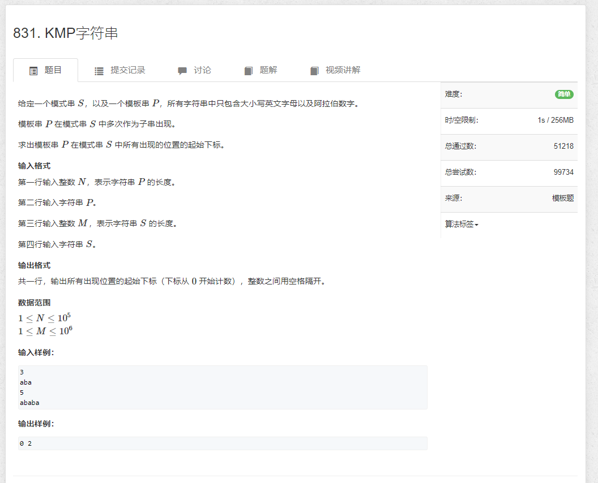

# 831.KMP字符串

```java
import java.util.*;
import java.io.*;

public class Main {
    static BufferedReader reader = new BufferedReader(new InputStreamReader(System.in));
    static BufferedWriter writer = new BufferedWriter(new OutputStreamWriter(System.out));

    static Integer sti(String str) {
        return Integer.parseInt(str);
    }

    static int n, m;
    static int N = 10_0010, M = 100_0010;
    static char[] p = new char[N];
    static char[] S = new char[M];
    static int[] ne = new int[N];

    public static void main(String[] args) throws IOException {
        n = sti(reader.readLine());
        char[] chs = reader.readLine().toCharArray();
        for (int i = 1; i <= n; i++) {
            p[i] = chs[i - 1];
        }
        m = sti(reader.readLine());
        chs = reader.readLine().toCharArray();
        for (int i = 1; i <= m; i++) {
            S[i] = chs[i - 1];
        }

        for (int i = 2, j = 0; i <= n; i++) {
            while (j > 0 && p[i] != p[j + 1]) j = ne[j];
            if (p[i] == p[j + 1]) j++;
            ne[i] = j;
        }

        for (int i = 1, j = 0; i <= m; i++) {
            while (j > 0 && S[i] != p[j + 1]) j = ne[j];
            if (S[i] == p[j + 1]) j++;
            if (j == n) writer.write(i - n + " ");
        }

        writer.flush();
    }
}
```
