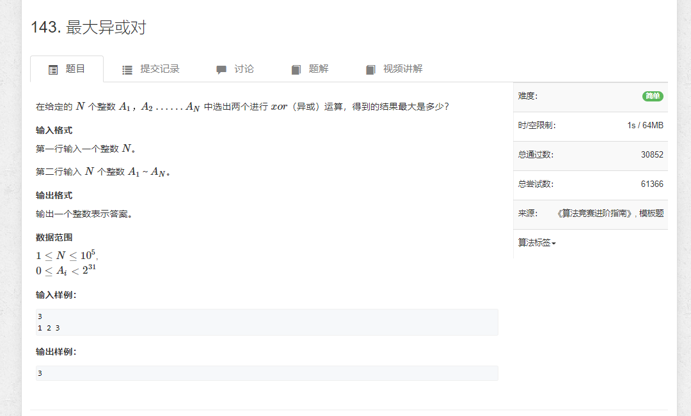

# 835.Trie字符串统计


```java
import java.util.*;
import java.io.*;

public class Main {
    static BufferedReader reader = new BufferedReader(new InputStreamReader(System.in));
    static BufferedWriter writer = new BufferedWriter(new OutputStreamWriter(System.out));

    static Integer sti(String str) {
        return Integer.parseInt(str);
    }

    static String[] rts() throws IOException {
        return reader.readLine().split(" ");
    }

    static int N = 100010;
    static int[][] son = new int[N][26];
    static int[] cnt = new int[N];
    static int idx = 0;

    static void insert(String str) {
        int p = 0;
        for (char c : str.toCharArray()) {
            int u = c - 'a';
            if (son[p][u] == 0) son[p][u] = ++idx;
            p = son[p][u];
        }

        cnt[p]++;
    }

    static int find(String str) {
        int p = 0;
        for (char c : str.toCharArray()) {
            int u = c - 'a';
            if (son[p][u] == 0) return 0;
            p = son[p][u];
        }

        return cnt[p];
    }

    public static void main(String[] args) throws IOException {
        int n = sti(rts()[0]);

        String[] strs = null;
        for (int i = 0; i < n; i++) {
            strs = rts();

            if ("I".equals(strs[0])) {
                insert(strs[1]);
            } else {
                writer.write(find(strs[1]) + "\n");
            }
        }


        writer.flush();
    }

}
```

# 143.最大异或对

```java
import java.util.*;
import java.io.*;

public class Main {
    static BufferedReader reader = new BufferedReader(new InputStreamReader(System.in));
    static BufferedWriter writer = new BufferedWriter(new OutputStreamWriter(System.out));

    static int N = 100010;
    static int M = 31 * N;
    static int[][] son = new int[M][2];
    static int idx = 0;

    static void insert(int x) {
        int p = 0;
        for (int i = 30; i >= 0; i--) {
            int u = x >> i & 1;
            if (son[p][u] == 0) son[p][u] = ++idx;
            p = son[p][u];
        }
    }

    static int find(int x) {
        int p = 0;
        int res = 0;
        for (int i = 30; i >= 0; i--) {
            int u = x >> i & 1;
            if (son[p][1 - u] != 0) {
                res += 1 << i;
                p = son[p][1 - u];
            } else {
                p = son[p][u];
            }
        }

        return res;
    }

    public static void main(String[] args) throws IOException {
        int n = Integer.parseInt(reader.readLine().split(" ")[0]);

        String[] strs = reader.readLine().split(" ");
        int[] arr = new int[n];

        for (int i = 0; i < n; i++) {
            arr[i] = Integer.parseInt(strs[i]);
            insert(arr[i]);    
        }

        int res = 0;
        for (int i = 0;  i < n; i++) {
            res = Math.max(res, find(arr[i]));
        }

        System.out.println(res);
    }

}
```
