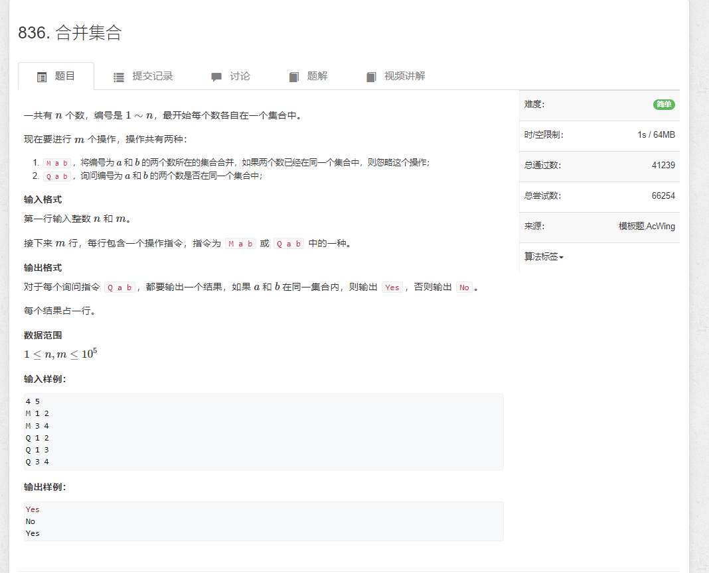
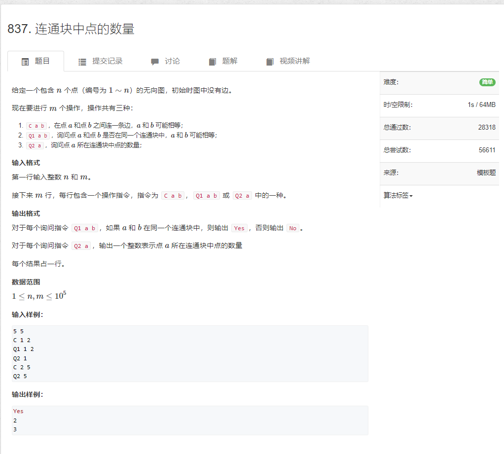
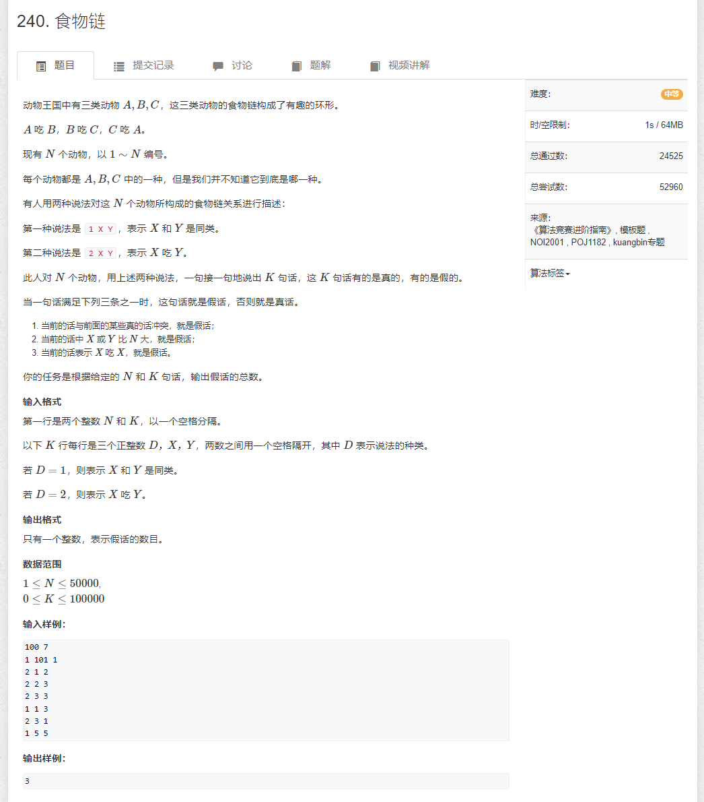

# 836.合并集合

```java
import java.util.*;
import java.io.*;

public class Main {
    static BufferedReader reader = new BufferedReader(new InputStreamReader(System.in));
    static BufferedWriter writer = new BufferedWriter(new OutputStreamWriter(System.out));

    static Integer sti(String str) {
        return Integer.parseInt(str);
    }

    static String[] rts() throws IOException {
        return reader.readLine().split(" ");
    }

    static int N = 100010;
    static int n, m;
    static int[] p = new int[N];

    static int find(int x) {
        if (p[x] != x) {
            p[x] = find(p[x]);
        }

        return p[x];
    }

    public static void main(String[] args) throws IOException {
        String[] strs = rts();
        n = sti(strs[0]);
        m = sti(strs[1]);

        for (int i = 1; i <= n; i++) {
            p[i] = i;
        }

        while (m-- > 0) {
            strs = rts();

            if ("M".equals(strs[0])) {
                p[find(sti(strs[1]))] = find(sti(strs[2]));
            } else if ("Q".equals(strs[0])) {
                if (find(sti(strs[1])) == find(sti(strs[2]))) {
                    writer.write("Yes\n");
                } else {
                    writer.write("No\n");
                }
            }
        }

        writer.flush();
    }

}
```

# 837.连通块中点的数量

```java
import java.util.*;
import java.io.*;

public class Main {
    static BufferedReader reader = new BufferedReader(new InputStreamReader(System.in));
    static BufferedWriter writer = new BufferedWriter(new OutputStreamWriter(System.out));

    static String[] rts() throws IOException {
        return reader.readLine().split(" ");
    }

    static Integer sti(String[] strs, int i) {
        return Integer.parseInt(strs[i]);
    }

    static int N = 10_0010;
    static int[] p = new int[N];
    static int[] size = new int[N];
    static int find(int x) {
        if (p[x] != x) {
            p[x] = find(p[x]);
        }
        return p[x];
    }

    public static void main(String[] args) throws IOException {
        String[] strs = rts();
        int n = sti(strs, 0);
        int m = sti(strs, 1);

        for (int i = 1; i <= n; i++) {
            size[i] = 1;
            p[i] = i;
        }

        while (m-- > 0) {
            strs = rts();

            String s = strs[0];
            if ("C".equals(s)) {
                int i = sti(strs, 1);
                int j = sti(strs, 2);
                int u = find(i);
                int v = find(j);
                if (u == v) continue;
                p[u] = v;
                size[v] += size[u];
            } else if ("Q1".equals(s)) {
                int i = sti(strs, 1);
                int j = sti(strs, 2);
                int u = find(i);
                int v = find(j);
                writer.write(u == v ? "Yes\n" : "No\n");
            } else if ("Q2".equals(s)) {
                int i = sti(strs, 1);
                writer.write(size[find(i)] + "\n");
            }
        }


        writer.flush();
    }
}
```

# 240.食物链

```java

```
