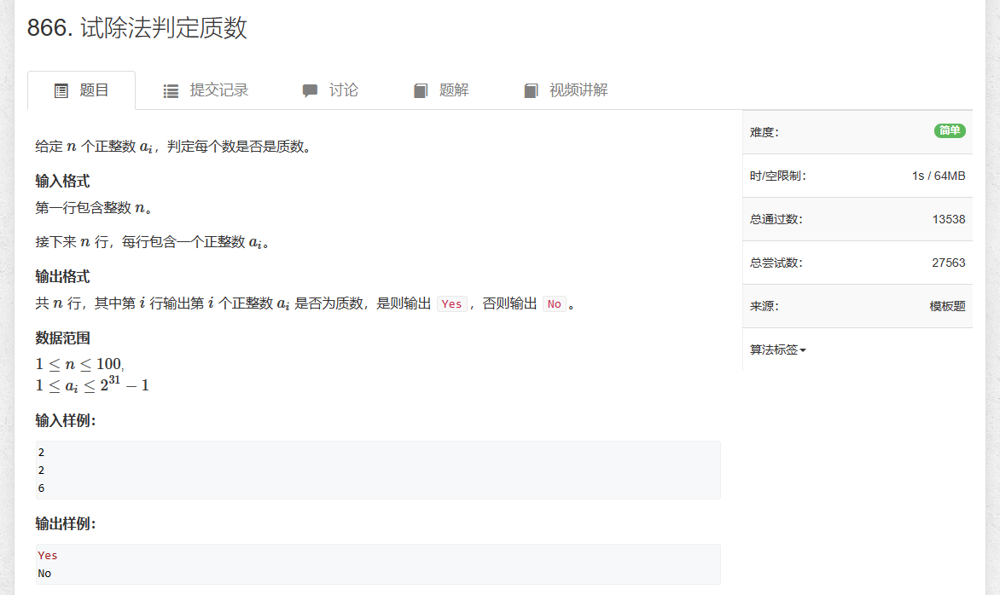
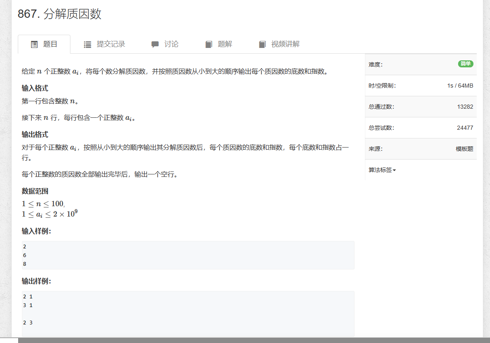
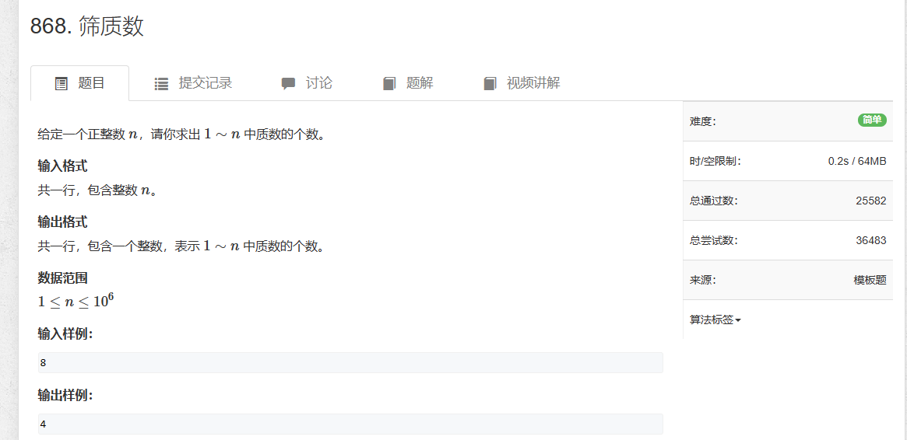

# 1.试除法判定质数



```java
import java.util.*;
import java.io.*;

public class Main {
    public static void main(String[] args) throws IOException {
        BufferedReader reader = new BufferedReader(new InputStreamReader(System.in));

        int n = Integer.parseInt(reader.readLine());
        while (n-- > 0) {
            int a = Integer.parseInt(reader.readLine());
            System.out.println(judge(a) ? "Yes" : "No");
        }

        reader.close();
    }

    private static boolean judge (int num) {
        if (num < 2) return false;
        for (int i = 2; i <= num / i; i++) {
            if (num % i == 0) return false;
        }

        return true;
    }
}
```

# 2.分解质因数


```java

import java.util.*;
import java.io.*;

public class Main {
    public static void main(String[] args) throws IOException {
        BufferedReader reader = new BufferedReader(new InputStreamReader(System.in));

        int n = Integer.parseInt(reader.readLine());

        while(n-- > 0) {
            int a = Integer.parseInt(reader.readLine());
            cul(a);    
        }


        reader.close();
    }

    private static void cul(int num) {
        for (int i = 2; i <= num / i; i++) {
           int s = 0;
           while (num % i == 0) {
               s++;
               num /= i;
           }

           if (s > 0) System.out.printf("%d %d\n", i, s);
        }
        if (num > 1) System.out.printf("%d 1\n", num);
        System.out.println();
    }
}
```


# 3.筛质数


```java
import java.util.*;
import java.io.*;

public class Main {

    static int N = 1000010;
    static boolean[] st = new boolean[N];
    static int[] primes = new int[N];
    static int cnt = 0;

    public static void main(String[] args) throws IOException {
        BufferedReader reader = new BufferedReader(new InputStreamReader(System.in));

        int n = Integer.parseInt(reader.readLine());
        getPrimes(n);
        System.out.println(cnt);

        reader.close();
    }

    // 埃氏筛法
    static void getPrimes(int n) {
        for (int i = 2; i <= n; i++) {
            if (!st[i]) {
                primes[cnt++] = i;
                for (int j = i; j <= n; j += i) {
                    st[j] = true;
                }
            }
        }
    }
}

```

```java
// 线性筛法，速度比埃氏快，可以用最小的质因子更新状态
static void getPrimes2(int n) {
    for (int i = 2; i <= n; i++) {
        if (!st[i]) primes[cnt++] = i;
        for (int j = 0; primes[j] <= n / i; j++) {
            st[primes[j] * i] = true;
            if (i % primes[j] == 0) break;
        }
    }
}
```
