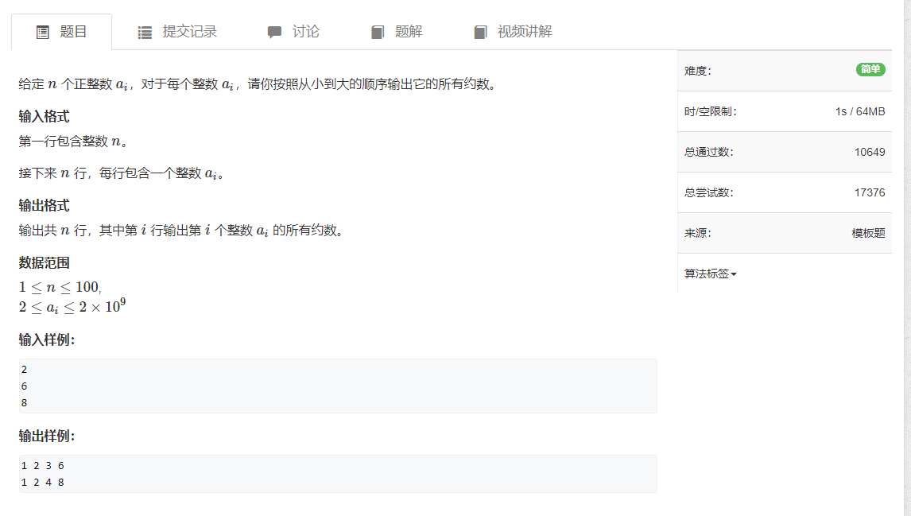

# 一、试除法求约数


```java
import java.util.*;
import java.io.*;

public class Main {
    public static void main(String[] args) throws IOException {
        BufferedReader reader = new BufferedReader(new InputStreamReader(System.in));

        int n = Integer.parseInt(reader.readLine());
        while (n-- > 0) {
            int a = Integer.parseInt(reader.readLine());
            getNums(a);
        }

        reader.close();
    }

    public static void getNums(int a) {
        List<Integer> list = new ArrayList<>();

        for (int i = 1; i <= a / i; i++) {
            if (a % i == 0) {
                list.add(i);
                if (i != a / i) {
                    list.add(a / i);
                }
            }
        }

        Collections.sort(list);
        for (int i = 0; i < list.size(); i++) {
            System.out.print(list.get(i) + " ");
        }
        System.out.println();
    }
}
```

# 二、约数个数


```java
import java.util.*;
import java.io.*;

public class Main {
    public static void main(String[] args) throws IOException {
        BufferedReader reader = new BufferedReader(new InputStreamReader(System.in));

        int n = Integer.parseInt(reader.readLine());
        Map<Integer, Integer> map = new HashMap<>();
        while (n-- > 0) {
            int a = Integer.parseInt(reader.readLine());
            getNums(a, map);
        }

        long res = 1;
        int mod = (int)(1e9 + 7);
        for (int v : map.values()) {
            res = (res * (v + 1)) % mod;
        }
        System.out.println(res);

        reader.close();
    }

    static void getNums(int a, Map<Integer, Integer> map) {
        for (int i = 2; i <= a / i; i++) {
            while (a % i == 0) {
                map.put(i, map.getOrDefault(i, 0) + 1);
                a /= i;
            }
        }

        if (a > 1) map.put(a, map.getOrDefault(a, 0) + 1);
    }
}
```

# 三、约数之和


```java
import java.util.*;
import java.io.*;

public class Main {

    static int mod = (int)(1e9 + 7);
    static int N = 110;

    public static void main(String[] args) throws IOException {
        BufferedReader reader = new BufferedReader(new InputStreamReader(System.in));

        int n = Integer.parseInt(reader.readLine());
        Map<Integer, Integer> map = new HashMap<>();
        while (n-- > 0) {
            int x = Integer.parseInt(reader.readLine());

            for (int i = 2; i <= x / i; i++) {
                while (x % i == 0) {
                    x /= i;
                    map.put(i, map.getOrDefault(i, 0) + 1);
                }
            }

            if (x > 1) map.put(x, map.getOrDefault(x, 0) + 1);
        }

        long res = 1L;
        for (Map.Entry<Integer, Integer> e : map.entrySet()) {
            int key = e.getKey();
            int value = e.getValue();

            long t = 1L;
            while (value-- > 0) {
                t = (t * key + 1) % mod;
            }
            res = res * t % mod;
        }

        System.out.println(res);

        reader.close();
    }
}
```

# 四、最大公约数


```java
import java.util.*;
import java.io.*;

public class Main {
    public static void main(String[] args) throws IOException {
        BufferedReader reader = new BufferedReader(new InputStreamReader(System.in));

        int n = Integer.parseInt(reader.readLine());
        String[] strs;
        while (n-- > 0) {
            strs = reader.readLine().split(" ");
            int a = Integer.parseInt(strs[0]);
            int b = Integer.parseInt(strs[1]);

            System.out.println(gcd(a, b));
        }

        reader.close();
    }

    static int gcd(int a, int b) {
        return b == 0 ? a : gcd(b, a % b);
    }
}
```
