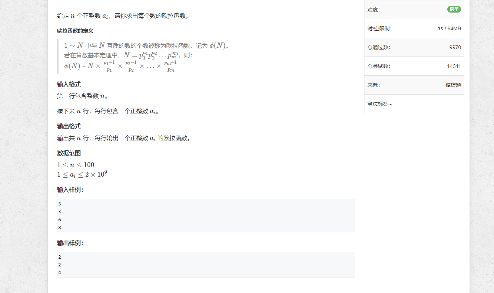

# 1.欧拉函数


```java
import java.util.*;
import java.io.*;

public class Main {
    public static void main(String[] args) throws IOException {
        BufferedReader reader = new BufferedReader(new InputStreamReader(System.in));

        int n = Integer.parseInt(reader.readLine());
        while (n-- > 0) {
            int num = Integer.parseInt(reader.readLine());

            System.out.println(cal(num));
        }

        reader.close();
    }

    private static int cal(int a) {
        int res = a;

        for (int i = 2; i <= a / i; i++) {
            if (a % i == 0) {
                while (a % i == 0) {
                    a /= i;
                }
                res = res / i * (i - 1);
            }
        }

        if (a > 1) {
            res = res / a * (a - 1);
        }

        return res;
    }
}
```
