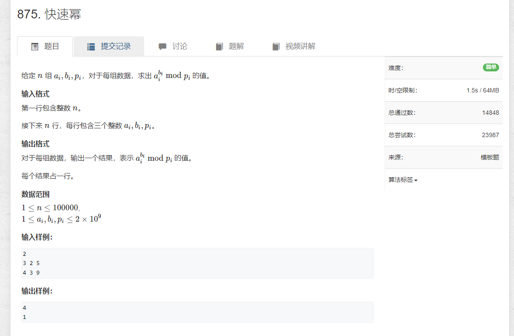

1. 快速幂


```java
import java.util.*;
import java.io.*;

public class Main {

    public static void main(String[] args) throws IOException{
        BufferedReader reader = new BufferedReader(new InputStreamReader(System.in));

        int n = Integer.parseInt(reader.readLine());
        String[] strs;
        while (n-- > 0) {
            strs = reader.readLine().split(" ");
            int a = Integer.parseInt(strs[0]);
            int k = Integer.parseInt(strs[1]);
            int p = Integer.parseInt(strs[2]);

            System.out.println(qmi(a, k, p));
        }

        reader.close();
    }

    static int qmi(long a, int k, int p) {
        long res = 1;
        while (k > 0) {
            if ((k & 1) > 0)  {
                res = res * a % p;
            }
            k >>= 1;
            a = a * a % p;

        }

        return (int)res;
    }
}
```
