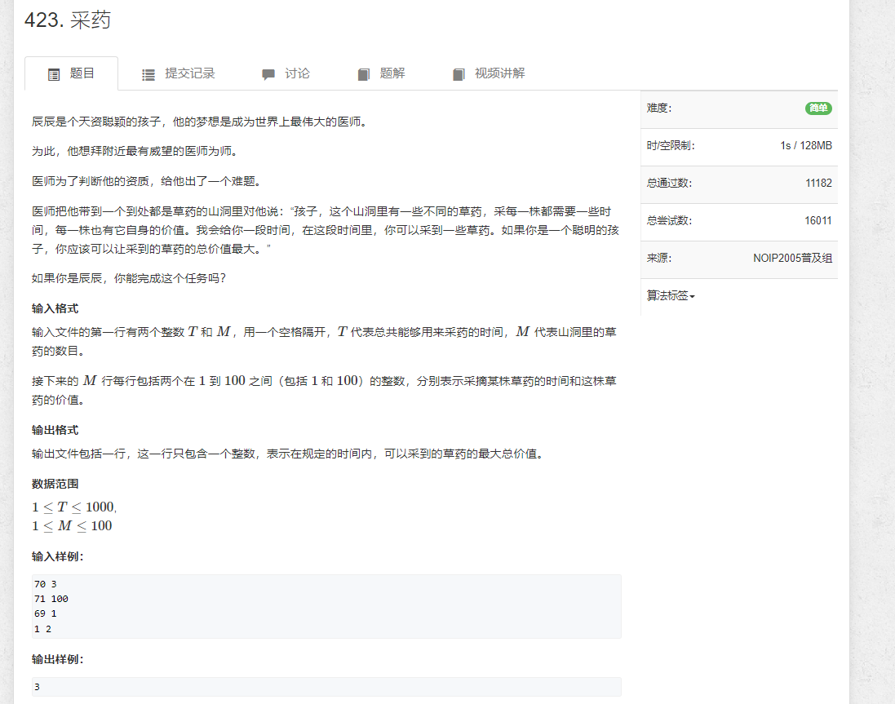
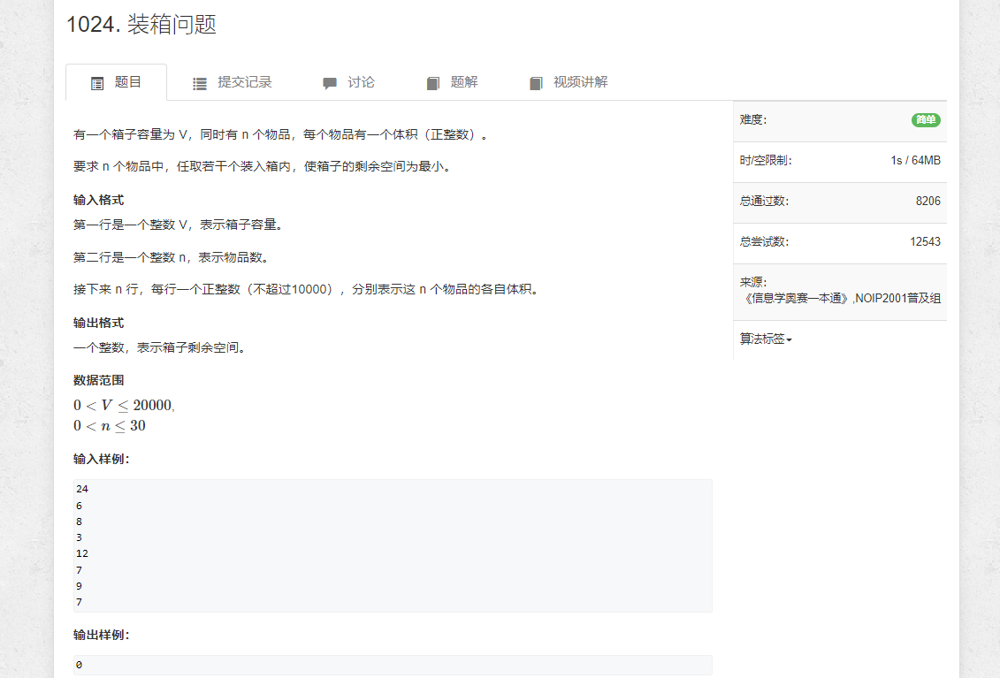
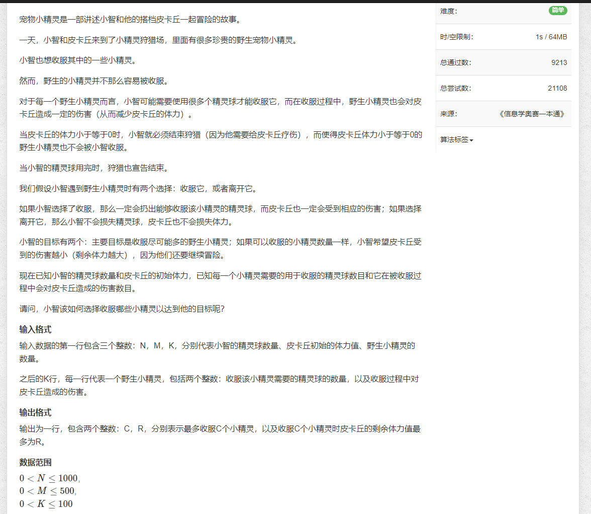
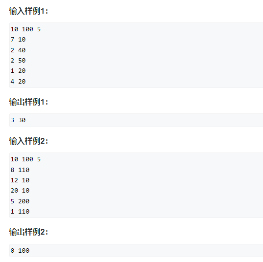

## 423. [采药](https://www.acwing.com/problem/content/425/)



~~~java
import java.util.*;

public class Main {
    
    static int T = 1010;
    static int M = 110;
    static int[] w = new int[M];
    static int[] v = new int[M];
    
    public static void main(String[] args) {
        Scanner input = new Scanner(System.in);
        
        int t = input.nextInt();
        int m = input.nextInt();
        for (int i = 0; i < m; i++) {
            w[i+1] = input.nextInt();
            v[i+1] = input.nextInt();
        }
        
        int[][] dp = new int[T][M];
        for (int i = 1; i <= t; i++) {
            for (int j = 1; j <= m; j++) {
                dp[i][j] = dp[i][j - 1];
                if (i >= w[j]) dp[i][j] = Math.max(dp[i][j], dp[i - w[j]][j - 1] + v[j]);
            }
        }
        
        System.out.println(dp[t][m]);
        input.close();
    }
}
~~~

## 1024. [装箱问题](https://www.acwing.com/problem/content/1026/)  



```java
import java.util.*;

public class Main {
    public static void main(String[] args) {
        Scanner input = new Scanner(System.in);
        
        int V = input.nextInt();
        int n = input.nextInt();
        int[] v = new int[n + 1];
        for (int i = 1; i <= n; i++) {
            v[i] = input.nextInt();
        }
        
        int[][] f = new int[V + 1][n + 1];
       
        for (int i = 1; i <= V; i++) {
            for (int j = 1; j <= n; j++) {
                f[i][j] = f[i][j - 1];
                if (i >= v[j]) f[i][j] = Math.max(f[i][j], f[i - v[j]][j - 1] + v[j]);
            }
        }
        System.out.println(V - f[V][n]);
        
        input.close();
    }
}
```

## 1022. [宠物小精灵之收服](https://www.acwing.com/problem/content/1024/)



