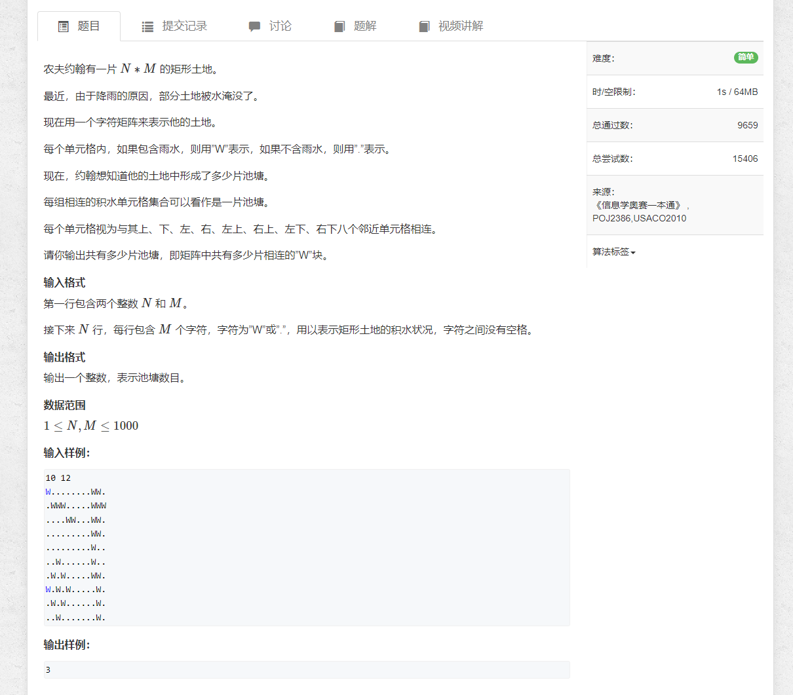
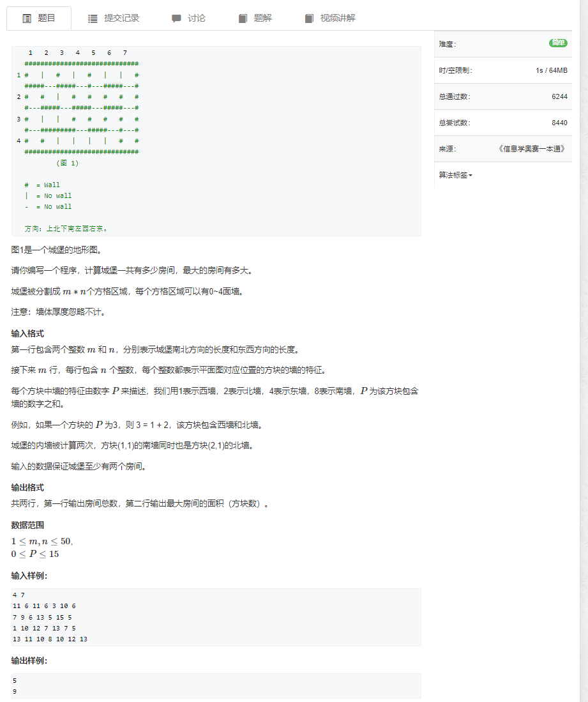
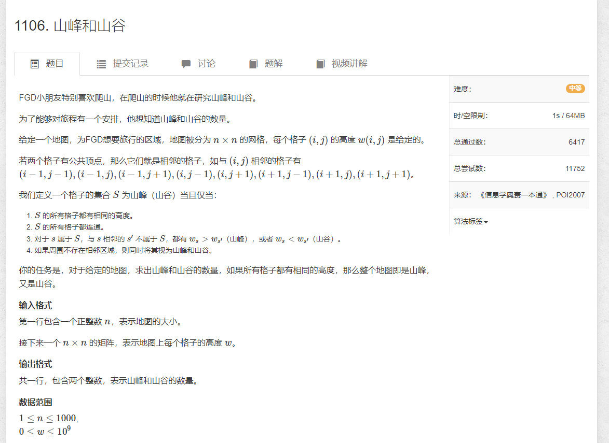
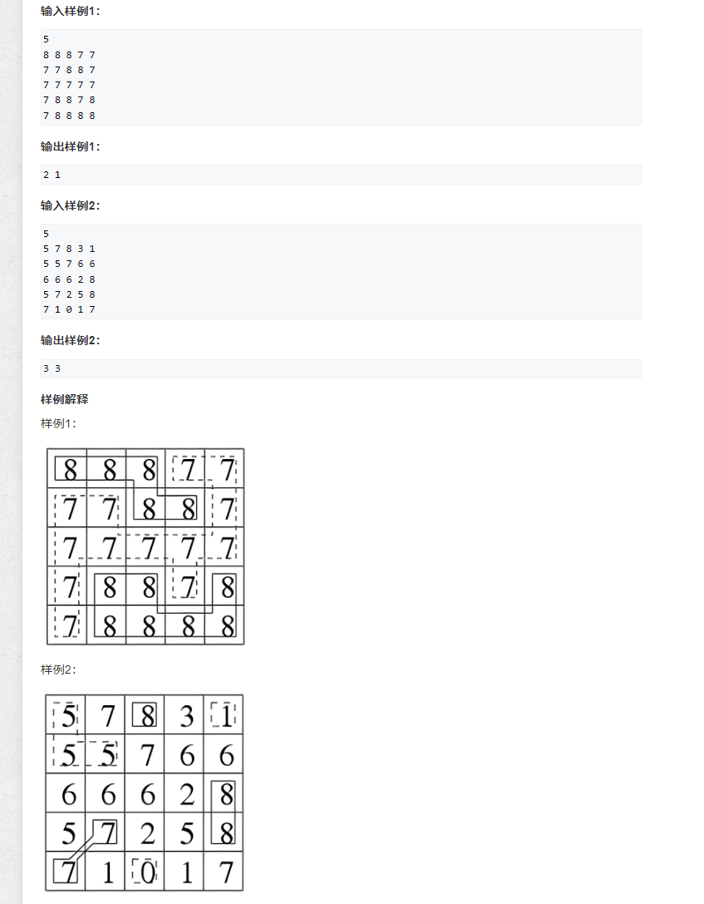

## [1097.池塘计数](https://www.acwing.com/problem/content/description/1099/)


```java
import java.util.*;

public class Main {
        
    static int[] dx = {1, 0, -1, 0, -1, -1, 1, 1};
    static int[] dy = {0, 1, 0, -1, 1, -1, 1, -1};
    
    public static void main(String[] args) {
        Scanner input = new Scanner(System.in);
        
        int n = input.nextInt();
        int m = input.nextInt();
        char[][] chs = new char[n][m];
        boolean[][] st = new boolean[n][m];
        int count = 0;
        
        for (int i = 0; i < n; i++) {
            String str = input.next();
            for (int j = 0; j < m; j++) {
                chs[i][j] = str.charAt(j);
            }
        }

        for (int i = 0; i < n; i++) {
            for (int j = 0; j < m; j++) {
                if (chs[i][j] == 'W' && !st[i][j]) {
                    count++;
                    bfs(i, j, chs, st);
                }
            }
        }
        
        System.out.println(count);
        
        input.close();
    }

    
    private static void bfs(int x, int y, char[][] chs, boolean[][] st) {
        st[x][y] = true;
        Queue<int[]> queue = new LinkedList<>();
        queue.offer(new int[]{x, y});
       
        while (!queue.isEmpty()) {
            for (int size = queue.size(); size > 0; size--) {
                int[] cur = queue.poll();
                int i = cur[0];
                int j = cur[1];
                
                for (int k = 0; k < 8; k++) {
                    int p = i + dx[k];
                    int q = j + dy[k];
                    
                    if (p < 0 || p >= chs.length || q < 0 || q >= chs[0].length) continue;
                    if (st[p][q] || chs[p][q] == '.') continue;
                    
                    st[p][q] = true;
                    queue.offer(new int[]{p, q});
                }
            }
        }
    }
}
```

## [1098.城堡问题](https://www.acwing.com/problem/content/1100/)



```java
import java.util.*;

public class Main {
    static int[] dy = {-1, 0, 1, 0};
    static int[] dx = {0, -1, 0, 1};
    
    public static void main(String[] args) {
        Scanner input = new Scanner(System.in);
        
        int m = input.nextInt();
        int n = input.nextInt();
        int[][] nums = new int[m][n];
        boolean[][] st = new boolean[m][n];
        int count = 0;
        int area = 0;
        for (int i = 0; i < m; i++) {
            for (int j = 0; j < n; j++) {
                nums[i][j] = input.nextInt();
            }
        }
        
        for (int i = 0; i < m; i++) {
            for (int j = 0; j < n; j++) {
                if (!st[i][j]) {
                    count++;
                    area = Math.max(area, bfs(i, j, nums, st));
                }
            }
        }
        
        System.out.println(count);
        System.out.println(area);
        input.close();
    }
    
    public static int bfs(int x, int y, int[][] nums, boolean[][] st) {
        int area = 1;
        st[x][y] = true;
        Queue<int[]> queue = new LinkedList<>();
        queue.offer(new int[]{x, y});
        
        while (!queue.isEmpty()) {
            for (int size = queue.size(); size > 0; size--) {
                int[] cur = queue.poll();
                int i = cur[0];
                int j = cur[1];
                
                for (int k = 0; k < 4; k++) {
                    int p = i + dx[k];
                    int q = j + dy[k];
                    
                    if (p < 0 || p >= nums.length || q < 0 || q >= nums[0].length) continue;
                    if (st[p][q]) continue;
                    if ((nums[i][j] >>> k & 1) != 0) continue; 
                    
                    area++;
                    st[p][q] = true;
                    queue.offer(new int[]{p, q});
                }
            }
        }
       
        return area;
    }
}
```


## [1106.山峰和山谷](https://www.acwing.com/problem/content/description/1108/)


```java
import java.util.*;

public class Main {
    
    static int peak = 0;
    static int valley = 0;
    static int[] dx = {-1, -1, -1, 0, 0, 1, 1, 1};
    static int[] dy = {1, 0, -1, 1, -1, 1, 0, -1};
    
    static void bfs(int[][] nums, boolean[][] st, int x, int y) {
        int val = nums[x][y];
        st[x][y] = true;
        
        Queue<int[]> queue = new LinkedList<>();
        queue.offer(new int[]{x, y});
        
        int highter = 0;
        int shorter = 0;
        while (!queue.isEmpty()) {
            for (int size = queue.size(); size > 0; size--) {
                int[] cur = queue.poll();
                int i = cur[0];
                int j = cur[1];
                
                for (int k = 0; k < 8; k++) {
                    int p = i + dx[k];
                    int q = j + dy[k];
                    
                    if (p < 0 || p >= nums.length || q < 0 || q >= nums.length) continue;
                    if (nums[p][q] == val) {
                        if (st[p][q]) continue;
                        else {
                            st[p][q] = true;
                            queue.offer(new int[]{p, q});
                        }
                    } else if (nums[p][q] > val) {
                        highter++;
                    } else if (nums[p][q] < val) {
                        shorter++;
                    }
                    
                }
            }
        }
        
        peak += highter == 0 ? 1 : 0;
        valley += shorter == 0 ? 1 : 0;
    }
    
    public static void main(String[] args) {
        Scanner input = new Scanner(System.in);
        
        int n = input.nextInt();
        int[][] nums = new int[n][n];
        boolean[][] st = new boolean[n][n];
        
        for (int i = 0; i < n; i++) {
            for (int j = 0; j < n; j++) {
                nums[i][j] = input.nextInt();
            }
        }
        
        for (int i = 0; i < n; i++) {
            for (int j = 0; j < n; j++) {
                if (!st[i][j]) {
                    bfs(nums, st, i, j);
                }
            }
        }
        
        System.out.println(peak + " " + valley);
        
        input.close();
    }
}
```