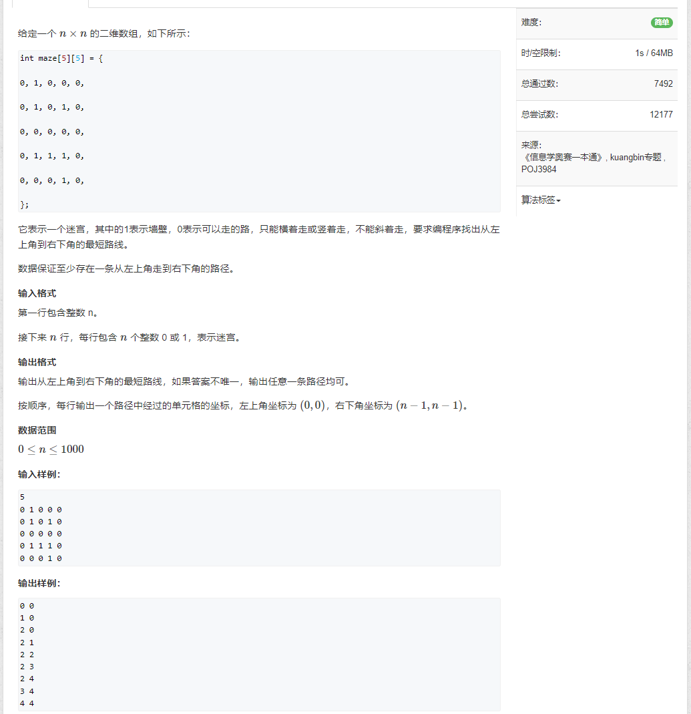
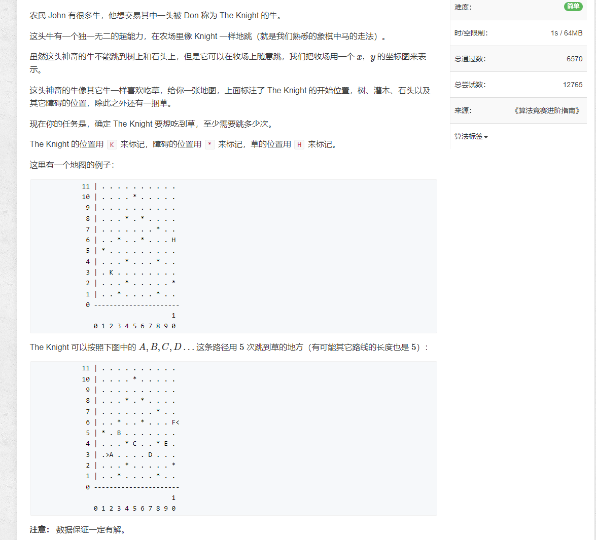
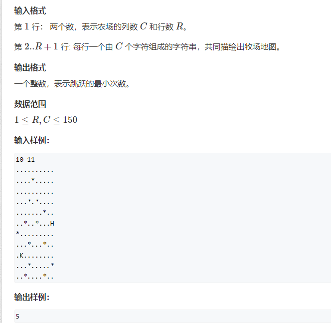

## [1076.迷宫问题](https://www.acwing.com/problem/content/1078/)


```java
import java.util.*;

public class Main {
    
    static int[] dx = {-1, 0, 1, 0};
    static int[] dy = {0, -1, 0, 1};
    
    public static void main(String[] args) {
        Scanner input = new Scanner(System.in);
        
        int n = input.nextInt();
        int[][] nums = new int[n][n];
        int[][] prev = new int[n][n];
        for (int i = 0; i < n; i++) {
            Arrays.fill(prev[i], -1);
            for (int j = 0; j < n; j++) {
                nums[i][j] = input.nextInt();
            }
        }
        
        Queue<int[]> queue = new LinkedList<>();
        queue.offer(new int[]{n - 1, n - 1});
        while (!queue.isEmpty() && prev[0][0] == -1) {
            for (int size = queue.size(); size > 0; size--) {
                int[] cur = queue.poll();
                int x = cur[0];
                int y = cur[1];
                
                for (int i = 0; i < 4; i++) {
                    int p = x + dx[i];
                    int q = y + dy[i];
                    
                    if (p < 0 || p >= n || q < 0 || q >= n) { continue; }
                    if (prev[p][q] != -1) { continue; }
                    if (nums[p][q] == 1) { continue; }
                    
                    prev[p][q] = x * n + y;
                    queue.offer(new int[]{p, q});
                }
            }
        }
        
        for (int i = 0, j = 0; i != n - 1 || j != n - 1; ) {
            System.out.println(i + " " + j);
            int val = prev[i][j];
            i = val / n; 
            j = val % n;
        }
        System.out.println((n - 1) + " " + (n - 1));
        
        input.close();
    }
}
```

## [188.武士风度的牛](https://www.acwing.com/problem/content/190/)



```java
import java.util.*;

public class Main {
    
    static int[] dx = {-2, -2, -1, -1, 1, 1, 2, 2};
    static int[] dy = {1, -1, 2, -2, 2, -2, 1, -1};
    
    public static void main(String[] args) {
        Scanner input = new Scanner(System.in);
        int c = input.nextInt();
        int r = input.nextInt();
        char[][] chs = new char[r][c];
        boolean[][] st = new boolean[r][c];
        int x = -1;
        int y = -1;
        for (int i = 0; i < r; i++) {
            String str = input.next();
            for (int j = 0; j < c; j++) {
                chs[i][j] = str.charAt(j);
                if (chs[i][j] == 'K') {
                    x = i;
                    y = j;
                }
            }
        }
        
        int res = bfs(chs, st, x, y);
        System.out.println(res);
        
        input.close();
    }
    
    private static int bfs(char[][] chs, boolean[][] st, int i, int j) {
        int dis = 0;
        st[i][j] = true;
        Queue<int[]> queue = new LinkedList<>();
        queue.offer(new int[]{i, j});
        
        while (!queue.isEmpty()) {
            dis++;
            for (int size = queue.size(); size > 0; size--) {
                int[] cur = queue.poll();
                int x = cur[0];
                int y = cur[1];
                
                for (int k = 0; k < dx.length; k++) {
                    int p = x + dx[k];
                    int q = y + dy[k];
                    
                    if (p < 0 || p >= chs.length || q < 0 || q >= chs[0].length) { continue; }
                    if (st[p][q] || chs[p][q] == '*') { continue; }
                    if (chs[p][q] == 'H') { return dis; }
                    
                    st[p][q] = true;
                    queue.offer(new int[]{p, q});
                }
            }
        }
        
        return dis;
    }
    
}
```

## [1100.抓住那头牛](https://www.acwing.com/problem/content/1102/)

```java
import java.util.*;

public class Main {
    public static void main(String[] args) {
        Scanner input = new Scanner(System.in);
        
        int n = input.nextInt();
        int k = input.nextInt();
        int[] nums = new int[100010];
        Arrays.fill(nums, -1);
        Queue<Integer> queue = new LinkedList<>();
        queue.offer(n);
        nums[n] = 0;
        
        while (nums[k] == -1) {
            int c = queue.poll();
            if (c + 1 < nums.length && nums[c + 1] == -1) {
                queue.offer(c + 1);
                nums[c + 1] = nums[c] + 1;
            }
            
            if (c - 1 >= 0 && nums[c - 1] == -1) {
                queue.offer(c - 1);
                nums[c - 1] = nums[c] + 1;
            }
            
            if (c + c < nums.length && nums[c + c] == -1) {
                queue.offer(c + c);
                nums[c + c] = nums[c] + 1;
            }
        }
        
        System.out.println(nums[k]);
        
        input.close();
    }
}
```
