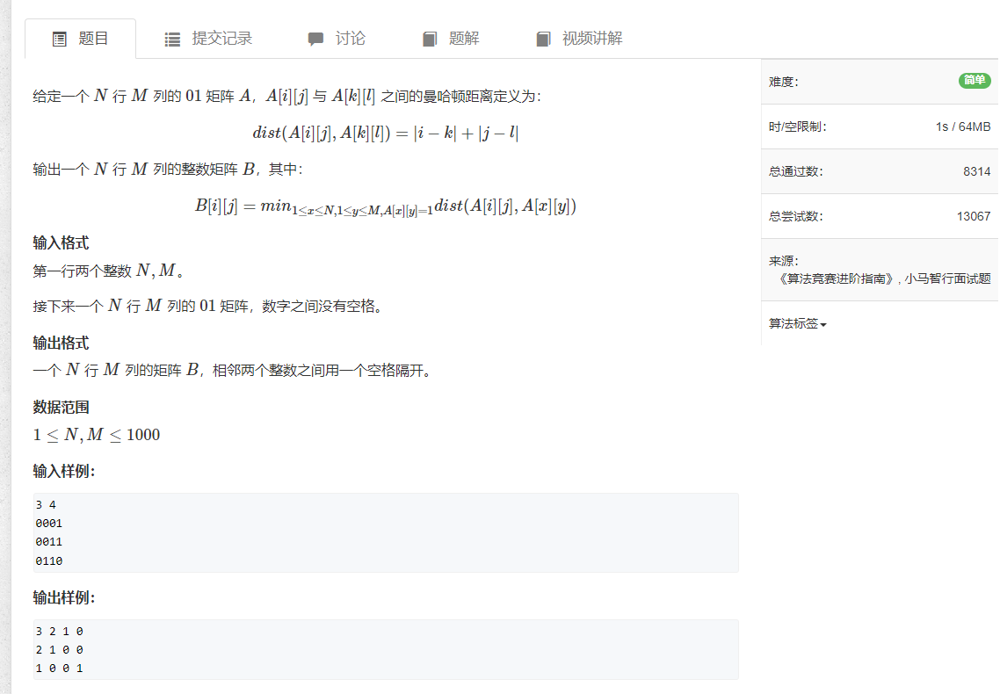

## [173.矩阵距离](https://www.acwing.com/problem/content/175/)

```java
import java.util.*;
import java.io.*;

public class Main {
    
    static int[] dx = {-1, 0, 1, 0};
    static int[] dy = {0, 1, 0, -1};
    
    public static void main(String[] args) throws IOException {
        Scanner input = new Scanner(System.in);
        
        int m = input.nextInt();
        int n = input.nextInt();
        int[][] nums = new int[m][n];
        Queue<int[]> queue = new LinkedList<>();
        int[][] res = new int[m][n];
        
        for (int i = 0; i < m; i++) {
            Arrays.fill(res[i], -1);
            String str = input.next();
            for (int j = 0; j < n; j++) {
                nums[i][j] = str.charAt(j) - '0';
                if (nums[i][j] == 1) {
                    queue.offer(new int[]{i, j});
                    res[i][j] = 0;
                }
            }
        }
        
        int dis = 0;
        while (!queue.isEmpty()) {
            dis++;
            for (int size = queue.size(); size > 0; size--) {
                int[] cur = queue.poll();
                int i = cur[0];
                int j = cur[1];
                
                for (int k = 0; k < 4; k++) {
                    int p = i + dx[k];
                    int q = j + dy[k];
                    
                    if (p < 0 || p >= m || q < 0 || q >= n) continue;
                    if (res[p][q] != -1) continue;
                    queue.offer(new int[]{p, q});
                    res[p][q] = dis;
                }
            }
        }
        
        BufferedWriter writer = new BufferedWriter(new OutputStreamWriter(System.out));
        for (int i = 0; i < m; i++) {
            for (int j = 0; j < n; j++) {
                writer.write(res[i][j] + " ");
            }
            writer.write("\n");
        }
        writer.flush();
        input.close();
    }
}
```