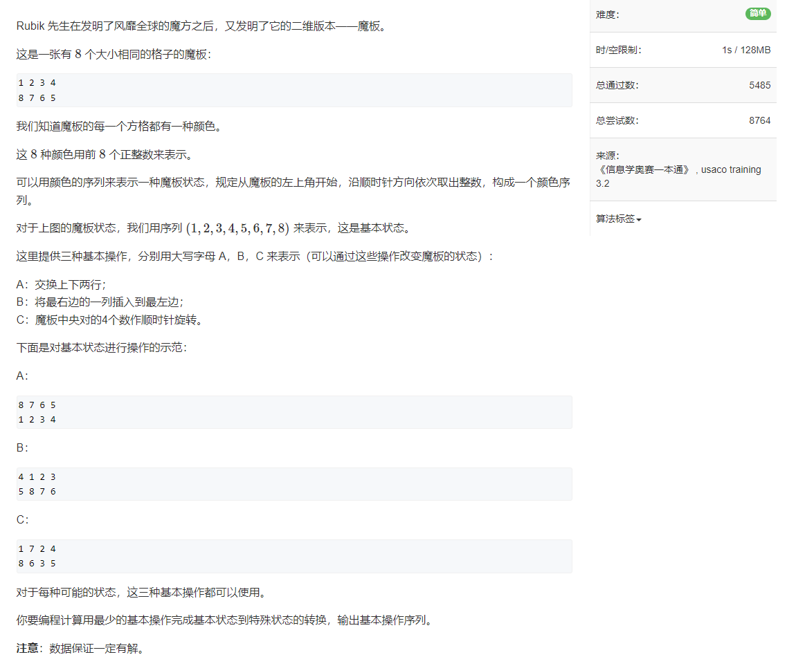
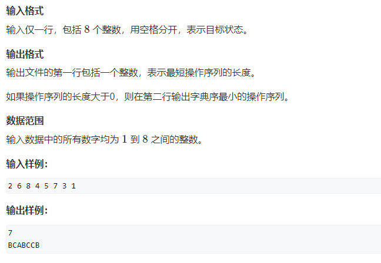

## [1107.魔板](https://www.acwing.com/activity/content/problem/content/1475/)


```java
import java.util.*;

public class Main {
    
    private static int count = 0;
    private static Queue<int[]> queue = new LinkedList<>();
    private static Queue<String> sq = new LinkedList<>();
    private static Set<Integer> set = new HashSet<>();
    
    private static boolean arrEqu(int[] a, int[] b) {
        for (int i = 0; i < a.length; i++) {
            if (a[i] != b[i]) return false;
        }
        return true;
    }
    
    private static void swap(int[] nums, int i, int j) {
        int temp = nums[i];
        nums[i] = nums[j];
        nums[j] = temp;
    }
    
    private static void met1(int[] arr, String opt) {
        for (int i = 0; i < 4; i++) {
            swap(arr, i, 4 + i);
        }

        queueOpt(val(arr), arr, opt + "A");
   
    }
    
    private static void queueOpt(int v, int[] nums, String opt) {
        if (!set.contains(v)) {
            sq.offer(opt);
            queue.offer(nums);
            set.add(v);
        }
    }
    
    private static void met3(int[] arr, String opt) {
        swap(arr, 1, 2);
        swap(arr, 1, 6);
        swap(arr, 1, 5);
        
        queueOpt(val(arr), arr, opt + "C");
    }
    
    private static void met2(int[] arr, String opt) {
         swap(arr, 2, 3);
        swap(arr, 1, 2);
        swap(arr, 0, 1);
        swap(arr, 6, 7);
        swap(arr, 5, 6);
        swap(arr, 4, 5);
        
        queueOpt(val(arr), arr, opt + "B");
    }
    
    private static int val(int[] nums) {
        int res = 0;
        for (int i = 0; i < 8; i++) {
            res = res * 10 + nums[i];
        }
        return res;
    }
    
    private static void bfs(int[] ori, int[] arr) {
        if (arrEqu(ori, arr)) return;
        queue.offer(ori.clone());
        sq.offer("");
        set.add(val(ori));
        
        while (!queue.isEmpty()) {
            for (int size = queue.size(); size > 0; size--) {
                int[] nums = queue.poll();
                if (arrEqu(nums, arr)) return;
            
                String cur = sq.poll();
                met1(nums.clone(), cur);
                met2(nums.clone(), cur);
                met3(nums.clone(), cur);
            }
            count++;
        }
        
    }
    
    public static void main(String[] args) {
        Scanner input = new Scanner(System.in);
        
        int[] arr = new int[8];
        for (int i = 0; i < 4; i++) {
            arr[i] = input.nextInt();
        }
        for (int i = 7; i > 3; i--) {
            arr[i] = input.nextInt();
        }
        
        // System.out.println(Arrays.toString(arr));
        int[] ori = {1, 2, 3, 4, 8, 7, 6, 5};
        
        bfs(ori, arr);
        System.out.println(count);
        
        if (count > 0) {
            System.out.println(sq.peek());
        }
        
        input.close();
    }
}
```