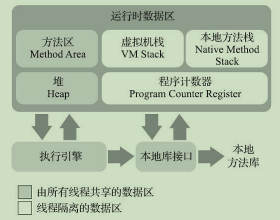

## 1.Java虚拟机运行时数据区
包括 方法区、堆、虚拟机栈、本地方法栈、程序计数器  
线程共享：方法区、堆  
线程隔离：虚拟机栈、本地方法栈、程序计数器  

### 1.1 程序计数器
程序计数器是一块较小的内存空间，它可以看作是当前线程所执行的字节码的行号指示器。在Java虚拟机的概念模型里，字节码解释器工作时就是通过改变这个计数器的值来选取下一条需要执行的字节码指令，它是程序控制流的指示器，分支、循环、跳转、异常处理、线程恢复等基础功能都需要依赖这个计数器来完成。  

  
由于Java虚拟机的多线程是通过线程轮流切换，分配处理器的执行时间的方式来实现的，在任何一个确定的时刻，一个处理器（对于多核处理器来说是一个内核）都只会执行一条线程中的指令。因此，为了线程切换后能恢复到正确的执行位置，每条线程都需要有一个独立的程序计数器，各条线程之间计数器互不影响，独立存储，我们称这类内存区域为“线程私有”的内存。  
  
如果线程正在执行的是一个Java方法，这个计数器记录的是正在执行的虚拟机字节码指令的地址，如果正在执行的是本地（Native）方法，这个计数器则应为空（Undefined）。此内存区域是唯一一个在《Java虚拟机规范》中没有规定任何OutOfMemoryError情况的区域。  

### 1.2 Java虚拟机栈
Java虚拟机栈也是线程私有的，它的生命周期与线程相同。虚拟机栈描述的是Java方法执行的线程内存模型，每个方法被执行的时候，Java虚拟机都会同步创建一个栈帧用于存储局部变量表、操作数栈、动态连接、方法出口等信息。每一个方法被调用直至执行完毕的过程，就对应这一个栈帧在虚拟机栈中从入栈到出栈的过程。