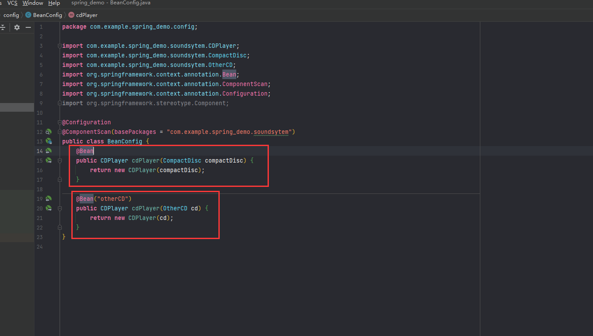
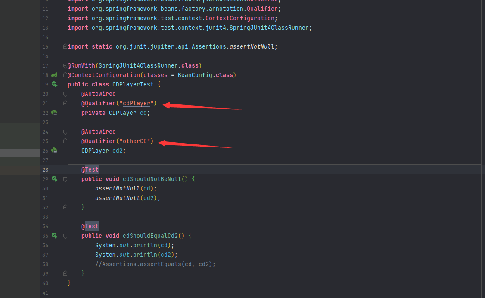
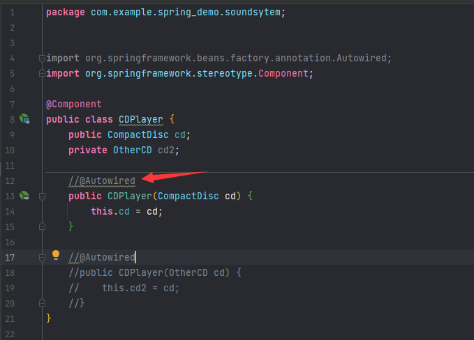
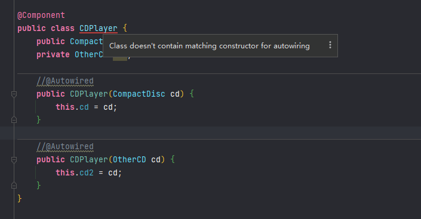
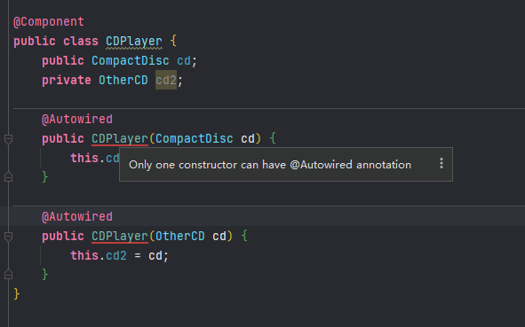

## 1. 装配Bean
### 1.1 如果一个`bean`有多个名字，那么注入的时候，需要使用`Qualifier`注解

### 1.2 对于自动装配，如果装配的`bean`需要其他加载其他`bean`，那么在引用的`bean`上加`@Component`注解
但是构造方法上或者setter方法上加并不需要`@Autowired`注解。

不过这种情况只适用于只有一个构造的情况，如果是多个，还是要在其中一个加上。不能多个加。
不加的话，有报错。

### 1.3 在构造和`setter`方法上同时都有`@Autowired`注解，那么优先使用构造
但是实际上`setter`方法并没有什么特殊之处，不管是构造器、`setter`方法还是其他的方法，`Spring`都会尝试满足方法参数上所声明的以来。加入有且只有一个`bean`匹配依赖请求的情况下，那么这个`bean`就会被装配起来。