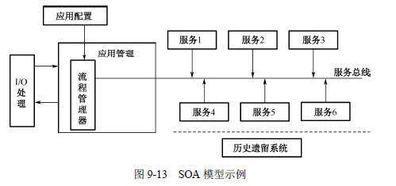

http://www.uml.org.cn/soa/202004152.asp?artid=23177#:~:text=%E6%9C%8D%E5%8A%A1%E4%B9%8B%E9%97%B4%E9%9C%80%E8%A6%81%E6%9F%90%E4%BA%9B%E6%96%B9%E6%B3%95%E8%BF%9B%E8%A1%8C%E8%BF%9E%E6%8E%A5%E3%80%82.%20%EF%BC%883%EF%BC%89Gartner%20%E7%9A%84%E5%AE%9A%E4%B9%89%EF%BC%9ASOA%20%E6%98%AF%E4%B8%80%E7%A7%8D%20C%2FS%20%E6%9E%B6%E6%9E%84%E7%9A%84%E8%BD%AF%E4%BB%B6%E8%AE%BE%E8%AE%A1%E6%96%B9%E6%B3%95%EF%BC%8C%E5%BA%94%E7%94%A8%E7%94%B1%E6%9C%8D%E5%8A%A1%E5%92%8C%E6%9C%8D%E5%8A%A1%E4%BD%BF%E7%94%A8%E8%80%85%E7%BB%84%E6%88%90%EF%BC%8CSOA%20%E4%B8%8E%E5%A4%A7%E5%A4%9A%E6%95%B0%E9%80%9A%E7%94%A8%E7%9A%84%20C%2FS,SOA%20%E7%9A%84%E7%B3%BB%E7%BB%9F%E5%B9%B6%E4%B8%8D%E6%8E%92%E9%99%A4%E4%BD%BF%E7%94%A8%20OOD%20%E6%9D%A5%E6%9E%84%E5%BB%BA%E5%8D%95%E4%B8%AA%E6%9C%8D%E5%8A%A1%EF%BC%8C%E4%BD%86%E6%98%AF%E5%85%B6%E6%95%B4%E4%BD%93%E8%AE%BE%E8%AE%A1%E5%8D%B4%E6%98%AF%E9%9D%A2%E5%90%91%E6%9C%8D%E5%8A%A1%E7%9A%84%E3%80%82.%20%E7%94%B1%E4%BA%8E%20SOA%20%E8%80%83%E8%99%91%E5%88%B0%E4%BA%86%E7%B3%BB%E7%BB%9F%E5%86%85%E7%9A%84%E5%AF%B9%E8%B1%A1%EF%BC%8C%E6%89%80%E4%BB%A5%E8%99%BD%E7%84%B6SOA%20%E6%98%AF%E5%9F%BA%E4%BA%8E%E5%AF%B9%E8%B1%A1%E7%9A%84%EF%BC%8C%E4%BD%86%E6%98%AF%E4%BD%9C%E4%B8%BA%E4%B8%80%E4%B8%AA%E6%95%B4%E4%BD%93%EF%BC%8C%E5%AE%83%E5%8D%B4%E4%B8%8D%E6%98%AF%E9%9D%A2%E5%90%91%E5%AF%B9%E8%B1%A1%E7%9A%84%E3%80%82.
# 一、SOA概述
SOA是一种在计算环境中设计、开发、部署和管理离散逻辑单元（服务）模型的方法。

# 二、SOA设计原则
## 1.明确定义的接口。服务请求者依赖于服务规约来调用服务，因此，服务定义必须长时间稳定，一旦公布，不能随意更改；服务的定义应尽可能明确，减少请求者的不适当使用；不要让请求者看到服务内部的私有数据。
## 2.自包含和模块化。服务封装了那些在业务上稳定、重复出现的活动和构建，实现服务的功能是完全独立自主的，独立进行部署、版本控制、自我管理和恢复。
## 3.粗粒度。服务数量不应该太多，依靠信息交互而不是远程过程调用，通常信息量比较大，但是服务之间的交互频度较低。
## 4.松耦合。服务请求者可见的是服务的接口，其位置、实现技术、当前状态和私有数据等，对服务请求者而言是不可见的。
## 5.互操作性、兼容和策略声明。为了确保服务规约的全面和明确，策略成为一个越来越重要的方面。这可以是技术相关的内容，例如，一个服务对安全性方面的要求；也可以是与业务有关的语义方面的内容，例如，需要满足的费用或者服务级别方面的要求，这些策略对于服务在交互时是非常重要的。
