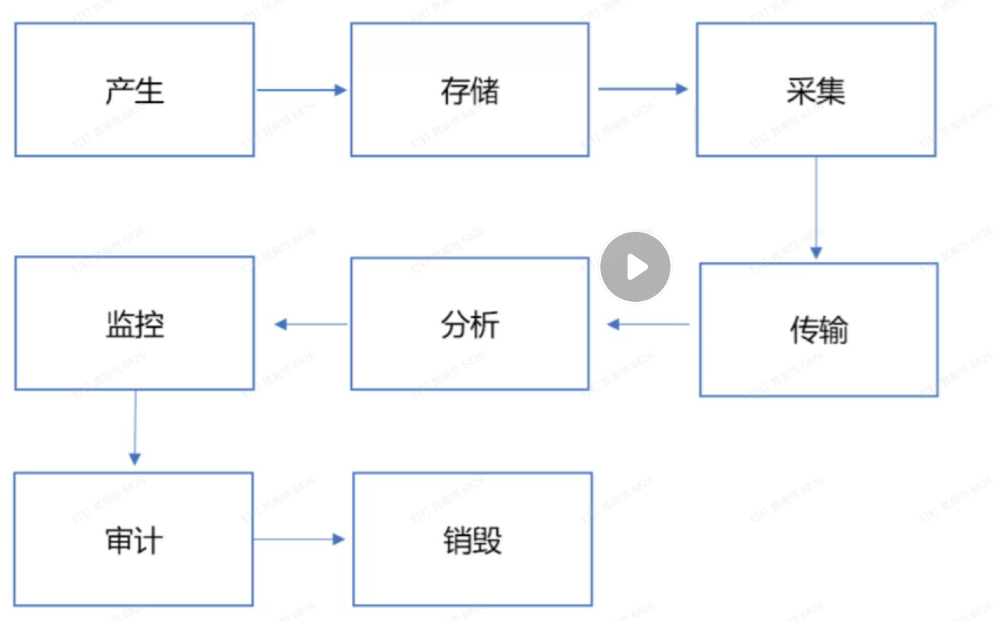
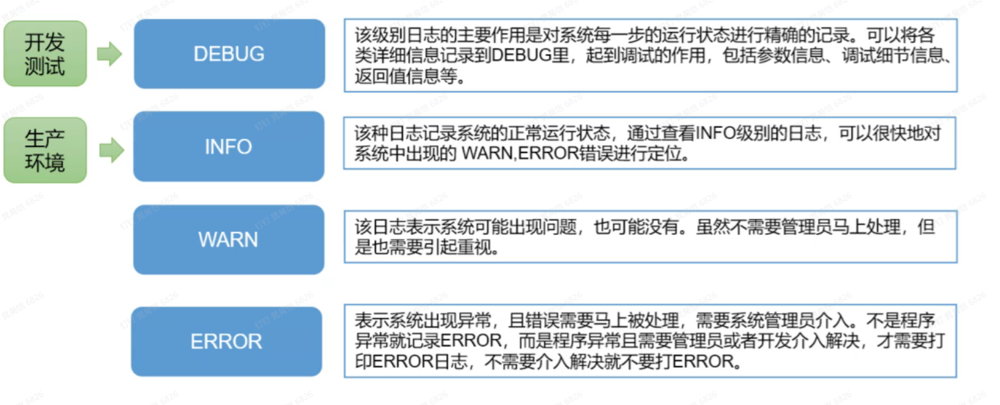
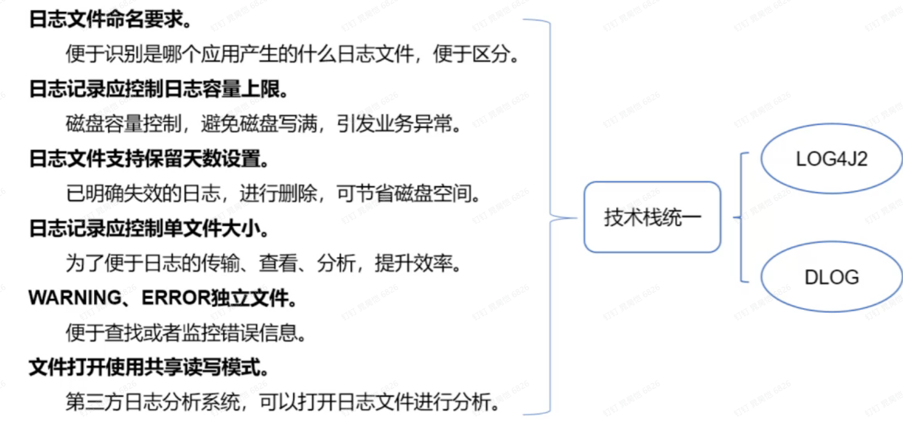
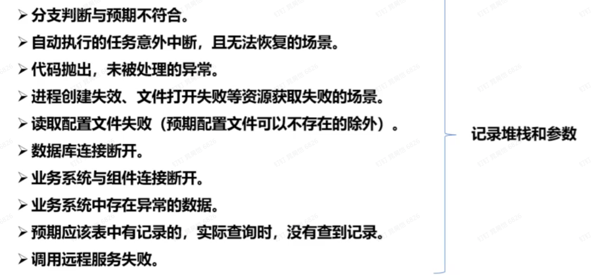
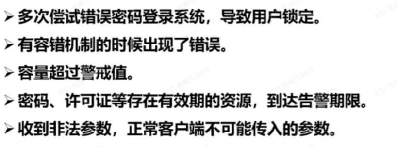

# 1.日志的生命周期

# 2.适当的日志级别

## 2.1 DEBUG
该级别日志的主要作用是对系统每一步的运行状态进行精确的记录。可以将各类详细信息记录到DEBUG里，起到调试的作用，包括参数信息、调试细节信息、返回值信息的等

## 2.2 INFO
该种日志记录系统的正常运行状态，通过查看INFO级别的日志，可以很快地对系统中出现的WARN，ERROR错误进行定位

## 2.3 WARN
该日志标识系统可能出现问题，也可能没有。虽然不需要管理员马上处理，但是也需要引起重视

## 2.4 ERROR
标识系统出现异常，且错误需要马上被处理，需要系统管理员接入。不是程序异常就记录ERROR，而是程序异常且需要管理员或者开发介入解决，才需要打印ERROR日志，不需要介入解决就不要打ERROR

# 3.日志文件要求

# 4.各级别常用场景
## 4.1 记录ERROR场景

* 分支判断与预期不符合
* 自动执行的任务意外中断，且无法恢复的场景
* 代码抛出，未被处理的异常
* 进程创建失效、文件打开失败等资源获取失败的场景
* 读取配置文件失败（预期配置文件可以不存在的除外）
* 数据库连接断开
* 业务系统与组件连接断开
* 业务系统中存在异常的数据
* 预期应该表中有记录的，实际查询时，没有查到记录
* 调用远程服务失败

## 4.2 记录WARN场景

* 多次尝试错误密码登录系统，导致用户锁定
* 有容错机制的时候出现了错误
* 容量超过警戒值
* 密码、许可证等存在有效的资源，到达告警期限
* 收到非法参数，正常客户端不可能传入的参数

## 4.3 记录INFO场景
* 记录服务内部关键的分支、函数出入参、返回等
* 记录服务启动时初始化信息，包括：创建的队列长度、加载的参数、环境信息等
* 记录重要状态的变更
* 与三方系统交互时，包括调用与被调用，需要记录完整的请求与应答（全链路已记录的除外）
* 记录批量操作的总量、处理成功数、处理失败数、批次等，便于核对记录数
