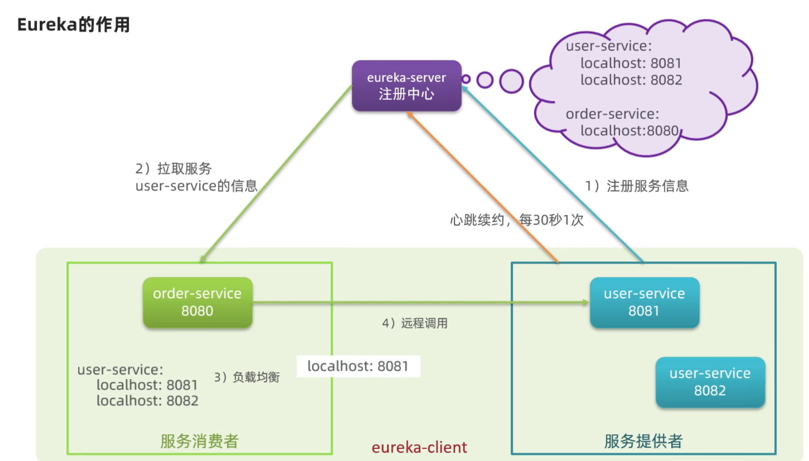
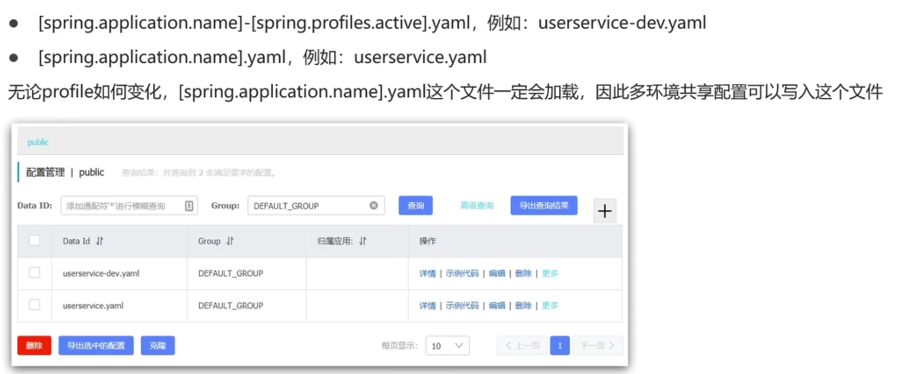
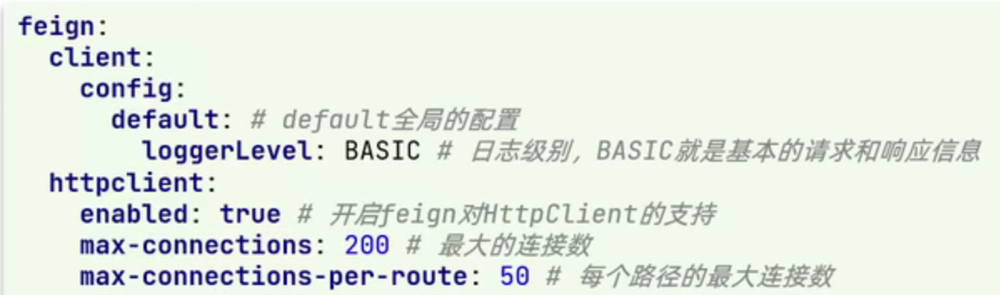
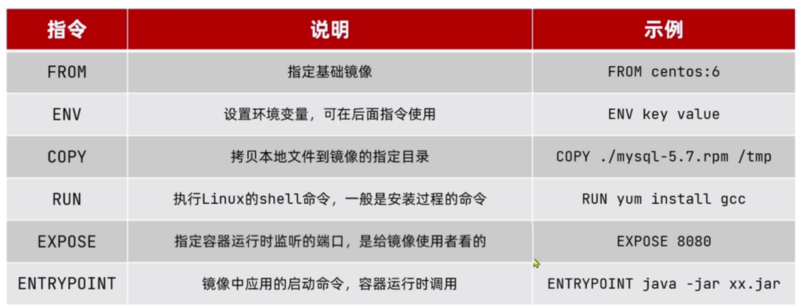

# 一、微服务技术栈


# 二、认识微服务
## 1.单体架构
将业务的所有功能集中在一个项目中开发，打成一个包部署。
优点：
* 架构简单
* 部署成本低

缺点：
* 耦合度高

## 2.分布式架构
根据业务功能对系统进行拆分，每个业务模块作为独立项目开发，称为一个服务。
优点：
* 降低服务耦合
* 有利于服务升级拓展

## 3.微服务
微服务是一种经过良好架构设计的分布式架构方案。
微服务架构特征：
* 单一职责：微服务拆分粒度更小，每一个服务都对应唯一的业务能力，做到单一职责，避免重复业务开发。
* 面向服务：微服务对外暴露业务接口
* 自治：团队独立、技术独立、数据独立、部署独立
* 隔离性强：服务调用做好隔离、容错、降级，避免出现级联问题

## 4.微服务技术对比


## 5.企业需求


# 三、服务拆分及远程调用
## 1.服务拆分注意事项
* 不同微服务，不要重复开发相同业务
* 微服务数据独立，不要访问其他微服务的数据库
* 微服务可以将自己的业务暴露为接口，供其他微服务调用

# 四、微服务远程调用

## 1.动手实践


## 2.远程调用方式分析


## 3.微服务远程调用-查询订单
### （1）注册 RestTemplate
在 order-service 的 OrderApplication 中注册 RestTemplate
### (2)修改方法


## 4.微服务调用方式
* 基于 RestTemplate 发起的 http 请求实现远程调用
* http 请求做远程调用是与语言无关的调用，只要知道对方的 ip、端口、接口路径、请求参数即可

## 5.提供者与消费者
* 服务提供者：一次业务中，被其他微服务调用的服务。（提供接口给其他微服务）
* 服务消费者：一次业务中，调用其他微服务的服务。（调用其它微服务提供的接口）

## 6.服务调用出现的问题
* 服务消费者该如何获取服务提供者的地址信息？
* 如果有多个服务提供者，消费者该如何选择？
* 消费者如何得知服务提供者的健康状态？

## 7.Eureka注册中心的作用

* 消费者该如何获取服务提供者具体信息？
  * 服务提供者启动时向eureka注册自己的信息
  * eureka保存这些信息
  * 消费者根据服务名称向eureka拉去提供者信息
* 如果有多个服务提供者，消费者该如何选择？
  * 服务消费者利用负载均衡算法，从服务列表中挑选一个
* 消费者如何感知服务提供者健康状态？
  * 服务提供者会每隔30秒向EurekaServer发送心跳请求，报告健康状态
  * eureka会更新记录服务列表信息，心跳不正常会被剔除
    * 消费者就可以拉取到最新的信息

## 8.搭建Eureka
### （1）注册Eureka


### （2）注册user-service


另外，我们可以将user-service多次启动，模拟多实例部署，但为了避免端口冲突，需要修改端口设置


### （3）在order-service完成服务拉取
服务拉取是基于服务名称获取服务列表，然后再对服务列表做负载均衡


### （4）总结


# 五、Ribbon负载均衡
## 1.负载均衡流程


## 2.负载均衡策略（常见）


通过定义IRule实现可以修改负载均衡规则，有两种方式：
1.代码方式：在order-service中的OrderApplication类中，定义一个新的IRule
```java
@Bean
public IRule randomRule() {
  return new randomRule();
}
```
2.配置文件：在application进行配置
```yml
userservice:
  ribbon:
    NFLoadBalancerRuleClassName: com.netflix.loadbalancer.RandomRule # 负载均衡策略
```

## 3.饥饿加载
Ribbon默认是采用懒加载，即第一次访问时才会去创建LoadBalanceClient，请求时间会很长，而饥饿加载则会在项目启动时创建，降低第一次访问的耗时，通过下面配置开启饥饿加载：


## 4.总结


# 六、nacos
## 1.启动
进入bin目录，然后执行命令.
windows命令：
>startup.cmd -m standalone

## 2.Nacos服务分级存储模型


## 3.服务跨集群调用问题
服务调用尽可能选择本地集群的服务，跨集群调用延迟较高。
本地集群不可访问时，再去访问其他集群。


## 4.设置负载均衡


## 5.环境隔离-namespace
Nacos中服务存储和数据存储的最外层都是一个名为namespace的东西，用来做最外层隔离。

* （1）在Nacos控制台可以创建namespace，用来隔离不同环境

* （2）然后填写一个新的命名空间信息

* （3）保存后会在控制台看到这个命名空间的id

* （4）修改Order-service的appliction.yml，添加namespace

* （5）重启order-service后，再来查看控制台
 
* （6）此时访问order-service，因为namespace不同，会导致找不到userservice，控制台会报错：


## 6.nacos注册中心细节分析
临时实例检测不到会被剔除，非临时实例不会。


## 7.临时实例与非临时实例
服务注册到Nacos时，可惜选择注册为临时或非临时实例，通过下面的配置来设置：


## 8.nacos与eureka
* Nacos与eureka的共同点
  * 都支持服务注册和服务拉取
  * 都支持服务提供者心跳方式做健康检测
* Nacos与eureka的区别
  * Nacos支持服务端主动检测提供者状态：临时实例采用心跳模式，非临时实例采用主动检测模式
  * 临时实例心跳不正常会被剔除，非临时实例则不会被剔除
  * Nacos支持服务列表变更的消息推送模式，服务列表更新更及时
  * Nacos集群默认采用AP方式，当集群中存在非临时实例时，采用CP模式；eureka采用AP方式

## 9.Nacos配置管理

### （1） 统一配置管理
* 配置更改热更新


* 在Nacos中添加配置信息：


* 在弹出表单中填写配置信息


* 配置获取的步骤如下


  * 引入Nacos的配置管理客户端依赖
  
  * 在userservice中的resourse目录添加一个bootstrap.yml文件，这个文件是引导文件，优先级高于application.yml
  
  * 在user-service中将pattern.dateformat这个属性注入到UserController中做测试：
  


### (2)配置自动刷新
Nacos中的配置文件变更后，微服务无需重启就可以感知。不过需要通过下面两种配置实现：
* 方式1：在@Value注入的变量类上添加注解@RefreshScope


* 方式2：使用@ConfigurationProperties(prefix = "**\")


注意事项：
* 不是所有的配置都适合放到配置中心，维护起来比较麻烦
  * 建议将一些关键参数，需要运行时调整的参数放到nacos配置中心，一般都是自定义配置

### （3）多环境配置共享
微服务启动时会从nacos读取多个配置文件：


多种配置的优先级：


### （4）nacos集群搭建
> 集群结构图


> 搭建集群的基本步骤
> * 搭建数据库，初始化数据库表结构
* 下载nacos安装包
* 配置nacos
* 启动nacos集群
* ngnix反向代理

## 10.http客户端Feign
### 10.1 RestTemplate方式调用存在的问题
* 代码可读性差，编程体验不统一
* 参数复杂URL难以维护

### 10.2 Feign的介绍
`Feign`是一个声明式的http客户端，官方地址:  https://github.com/OpenFeign/feign
可以解决RestTemplate的问题

### 10.3 定义和使用Feign客户端
使用Feign的步骤如下：
* 1.引入依赖

* 2.在order-service的启动类添加注解开启Feign的功能

* 3.编写Feign客户端

主要是基于SpringMVC的注解来生命远程调用的信息，比如：


### 10.4 自定义Feign的配置
Feign运行自定义配置来覆盖默认配置，可以修改的配置如下：


#### 10.4.1 配置Feign日志
两种方式
* 1.配置文件方式
  * （1）全局生效

  * （2）局部生效

* 2.Java代码方式，需要声明一个Bean


### 10.5 Feign的性能调优
Feign底层的客户端实现
* URLConnection： 默认实现，不支持连接池
* Apache HttpClient： 支持连接池
* OKHttp： 支持连接池
因此优化Feign的性能主要包括
* 使用连接池代替默认的URLConnection
* 日志级别，最好用basic或none

Feign添加HttpClient的支持：
* 引入依赖：

* 配置连接池


### 10.6 Feign的最佳实践
* 方式一：给消费者的FeignClient和提供者的controller定义统一的父接口作为标准

* 方式二（抽取）：将FeignClient抽取为独立模块，并且把接口有关的POJO、默认的Feign配置都放到这个模块中，提供给所有消费者使用

  * 实现方式二的步骤如下：
  

  * 当定义的FeignClient不在SpringBootApplication的扫描包范围是，这些FeignClient无法使用。有两种解决方式：
  

## 11.统一网关Gateway
### 11.1 为什么需要网关？
网关功能：
* 身份认证和权限校验
* 服务路由、负载均衡
* 请求限流


### 11.2 网关的技术实现


### 11.3 搭建网关服务
#### 11.3.1 创建新的module，引入SpringCloudGateway的一阿里和nacos的服务发现依赖


#### 11.3.2 编写路由配置及nacos地址
注意nacos地址
 


### 11.3.3 路由断言工厂Route Predicate Factory
网关路由可以配置的内容包括：
* 路由id：路由唯一标识
* uri：路由目的地，支持lb和http两种
* predicates：路由断言，判断请求是否复核要求，符合则转发到路由目的地
* filters：路由过滤器，处理请求或响应

我们在配置文件中写的断言规则只是字符串，这些字符串会被Predicate Factory读取并处理，转变为路由判断的条件
例如`Path=/user/**`是按照路径匹配，这个规则是由`org.springframework.cloud.gateway.handler.predicate.PathRoutePredicateFactory`类来处理的


### 11.3.4 路由过滤器`GatewayFilter`
`GatewayFilter`是网关中提供的一种过滤器，可以对进入网关的请求和微服务返回的响应做处理


如果要对所有的路由都生效，则可以将过滤器工厂写道default下：


### 11.3.5 全局过滤器 GlobalFilter
全局过滤器的作用也是处理一切进入网关的请求和微服务响应，与`GatewayFilter`的作用一样。
区别在于`GatewayFilter`通过配置定义，处理逻辑是固定的。而`GlobalFilter`的逻辑需要自己写代码实现。
定义方式是实现`GlobalFilter`接口


### 11.3.6 过滤器执行顺序


### 11.3.7 跨域问题处理
跨域：域名不一致就是跨域，主要包括：
* 域名不同： `www.taobao.com`和`www.taobao.org`
* 域名相同，端口不同：`localhost:8080`和`localhost:8081`

跨域问题：浏览器禁止请求的发起者与服务端发生跨域ajax请求，请求被浏览器拦截的问题
解决方案：CORS

网管处理跨域采用的同样是CORS方案，并且只需要简单配置即可实现


## 12.Docker
### 12.1 Dock如何解决依赖的兼容问题的？


### 12.2 Docker如何解决不同系统环境的问题？


### 12.3 Docker与虚拟机


### 12.4 镜像和容器
* 镜像
  * Docker将应用程序及其所需的依赖、函数库、环境、配置等文件打包在一起，称为镜像
* 容器
  * 镜像中的应用程序运行后形成的进行就是容器，只是Docker会给容器做隔离，对外不可见

### 12.5 Docker和DockerHub
* DockerHub
  * DockerHub是一个Docker镜像的托管平台。这样的平台称为Docker Registry
* 国内也有类似于DockerHub的公开服务，比如网易云镜像服务、阿里云镜像库等

### 12.6 Docker架构
Docker是一个CS架构的程序，由两部分组成：
* 服务端：Docker守护进程，负责处理Docker指令，管理镜像、容器等
* 客户端：通过命令或RestAPI向Docker服务端发送指令。可以在本地或远程向服务端发送指令。


### 12.7 镜像操作命令


### 12.8 容器相关命令


### 12.9 Docker基本操作
创建运行一个Nginx容器


运行一个redis docker
```bash
docker run --name mr -p 6379:6379 -d redis redis-server --appendonly yes
```
### 12.10 数据卷


数据卷是一个虚拟目录，指向宿主机文件系统中的某个目录


操作数据卷：


案例：


### 12.11 挂载数据卷
我们在创建容器时，可以通过`-v`参数来挂在一个数据卷到某个容器目录


### 12.12 Dockfile自定义镜像
#### 12.12.1 镜像结构
* 镜像是将应用程序及其需要的系统函数库、环境、配置、依赖打包而成
* 以MySQL为例：

* 镜像是分层结构，每一层称为一个Layer
  * BaseImage曾：包含基本的系统函数库、环境变量、文件系统
  * Entrypoint：入口，是镜像中应用启动的命令
  * 其他：在BaseImage基础上添加依赖、安装程序、完成整个应用的安装和配置

#### 12.12.2 什么是Dockerfile
Dockerfile就是一个文本文件，其中包含一个个的指令，用指令来说明要执行什么操作来构建镜像。每一个指令都会形成一曾Layer。



### 12.13 DockerCompose
Docker Compose可以基于Compose文件帮我们快速的部署分布式应用，而无需手动一个个创建和运行容器！
Compose文件是一个文本文件，通过指令定义集群的每个容器如何运行。


